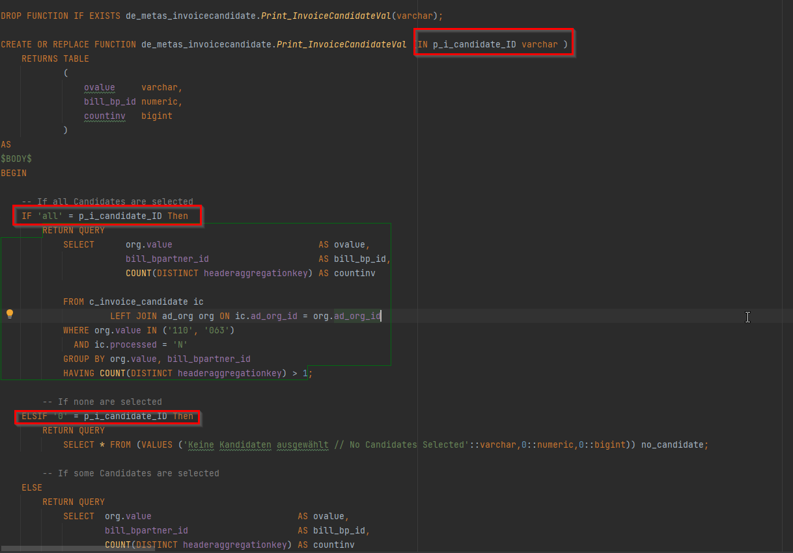
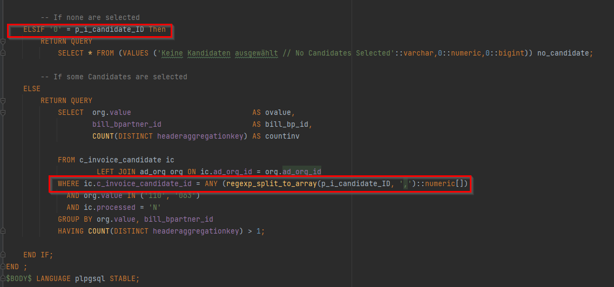
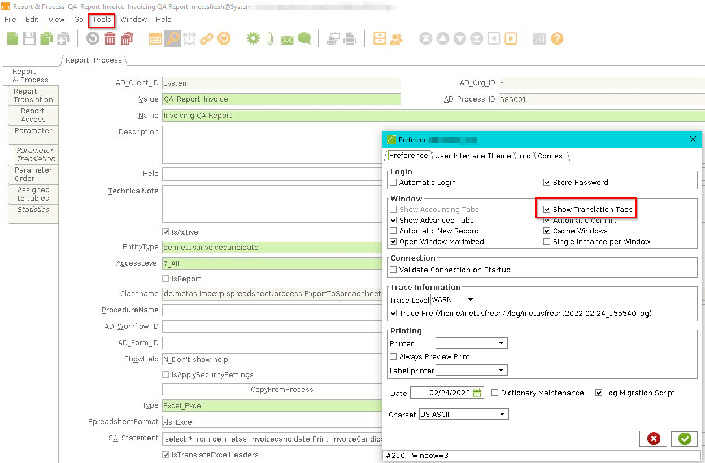
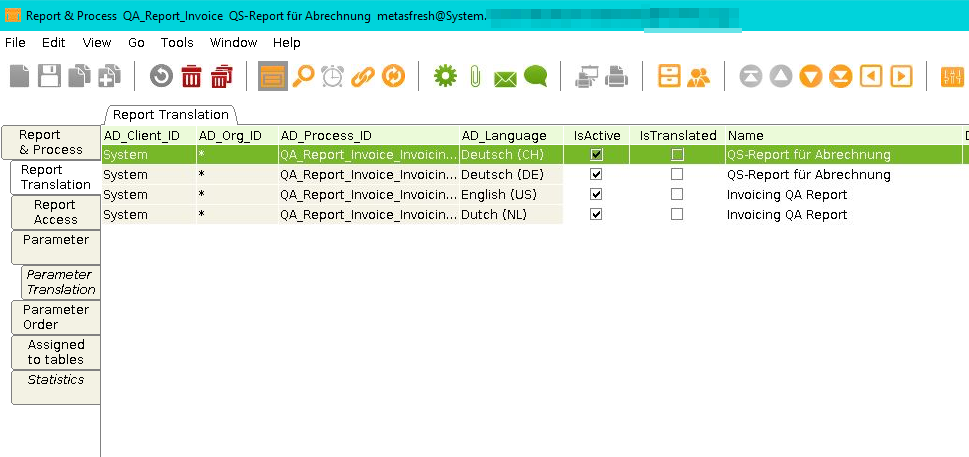

## Overview
* This guide shows you how to provide the resultset of an SQL to the user as Excel export by running a process.
* How to add `Translations Tabs` in a running process.

## Origin
Was developed by this issue: https://github.com/metasfresh/metasfresh/issues/4633.


other relevant issues:
https://github.com/metasfresh/onboarding/issues/12
https://github.com/metasfresh/me03/issues/10686



## In General
* Classname (will be automatically set and made read-only): `de.metas.impexp.excel.process.ExportToExcelProcess`

> In version 5.91 is a bug which prevents the class from being set automatically.<br> **Workaround:** `update ad_process set classname='de.metas.impexp.excel.process.ExportToExcelProcess'
where ad_process_id= <your ad_process id>`

* Your select, e.g.,
```sql
select
@C_Order_ID/-1@ as C_Order_ID
, @AD_User_ID/-1@ as AD_User_ID
, @C_BP_Group_ID/-1@ as C_BP_Group_ID
, bp.*
from C_BPartner bp
```

The context variables used in SQL will be resolved in following order:
* process parameter e.g. `where c_order_id = @C_Order_ID/-1@`
* current selected record's field. e.g. `where <column> in ('@$WEBUI_ViewSelectedIds/0@')`
* global context e.g. `@#AD_User_ID@`


## Additional Information

#### 1. AD_Column.DefaultValue and AD_Field.DefaultValue
* Note that there can be several windows with tabs that have fields pointing to the same column.
* When a default value is defined on AD_Column level, that value will have the default value no matter where it is used.
* When a default value is defined on AD_Field level, it means that it will be applied only in that field of that window.
* The AD_Field default value overrides the AD_Column one.

#### 2. The DefaultValue SQL syntax

* A default value can be:

 * A constant like `A` or `Y`.
 * A value from the global context , for example `@#AD_Client_ID@`, which is the AD_Client_ID we logged in with . We know this is a global context value because of the `#`. Even if there is another AD_Client_ID selected in the local context, when `#` is present, it will always retrieve the global value.
 * A value from the local context, for example `@AD_Client_ID@`, which is the "closest" AD_Client_ID from the context. For example, if I logged in with client X, then I open window A which has client Y, then the value Y will be taken.
 * A more complex sql, like `@SQL=SELECT COALESCE(MAX(SeqNo),0) + 100 AS DefaultValue FROM C_PricingRule` . Note that it starts with `@SQL=` but this `@` doesn't have to be paired with another one at the end ❗ .

* An SQL statement starts with:
`@sql= <sql statement here>`

[Commented by Ruxi in issue:https://github.com/metasfresh/onboarding/issues/12 ]: #

#### 3. The WEBUI_ViewSelectedIds

* WEBUI_ViewSelectedIds is a value for the currently selected record's field e.g. `where <column> in ('@$WEBUI_ViewSelectedIds/0@')`.
* Since the input of `WEBUI_ViewSelectedIds` is going to be a continous varchar, you would need to split the input. As an example : `ANY (regexp_split_to_array(p_i_candidate_ID, ',')::numeric[])`. In this example `p_i_candidate_ID` is the inputed parameter.


## Sample
<details><summary>How to Create and Bind Processes </summary>


</details>

<details><summary>How to Create and Bind Processes for Selected Records</summary>





</details>

<details><summary>How to add Translations to a Process</summary>

* Open `Tools` then `Preferences` and tick the box with `Show Translations Tabs`



* Then Restart Java Client/SwingUI afterwards the Tabs will be visible.



</details>
