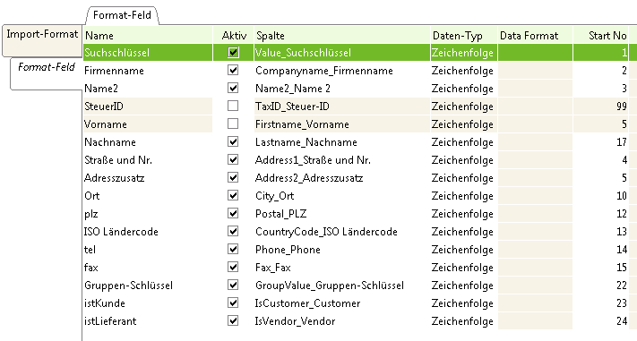

## Vorbereitung
Bevor Du mit dem Import beginnst ist es wichtig ein paar Grundsätzliche Dinge über das Datenmodell von metasfresh zu wissen.

Daher empfehlen wir Dir hier mal reinzuschauen:
- [Wie viele Adressen und Kontakte kann ein Partner haben?](Wie_viele_Adressen_und_Kontakte_kann_ein_Partner_haben)
- [Woraus setzt sich die fertige Belegadresse zusammen?](Woraus_setzt_sich_die_fertige_Belegadresse_zusammen)
- [Wie ordne ich die Kunden und Lieferantendaten aus dem Altsystem am besten zu?](Wie_ordne_ich_die_Kunden_und_Lieferantendaten_aus_dem_Altsystem_am_besten_zu)


## Importformat anlegen

Auf Basis des Standarddefinition für den Partnerimport möchten wir ein eigenes Importformat anlegen.

1. Fenster "Import-Format" öffnen
1. Neuen Datensatz anlegen
1. Feld **Name**: z.B. "Partnerimport" eintragen
1. Feld **DB-Tabelle**: "I_BPartner_Import - Geschäftspartner" auswählen
1. Feld **Format**: Trennzeichen auswählen. z.B. Tab
1. Datensatz speichern
1. Button "Positionen kopieren" anklicken
1. Import-Format "Geschäftspartner Standard" auswählen
1. OK klicken. 

   Jetzt wird das soeben angelegte Import-Format "Partnerimport" um die Standardfelder ergänzt. Das Ergebnis steht als Datensatzliste im Register "Format-Feld".

## Importformat anpassen

1. Register "Format-Feld" öffnen
1. nicht benötigte Felder auf inaktiv setzen. Die aktiven Felder müssen den Feldern der CSV Datei entsprechen die Du importieren möchtest. 

   Diese Felder brauchst Du mindestens:
    - Suchschlüssel
    - Firmenname
    - Straße und Nr
    - Ort
    - ISO Ländercode (Zweistelliger Code wie z.B. "DE")
   
1. Feld **startno** setzen

   Die **Startno** bestimmt die Position an der eine Spalte von metasfresh beim Import erwartet wird.
   Dabei ist es nicht nötig, dass die Felder in einer festen und aufsteigenden Reihenfolge sind.

### Beispiel





## Importdatei erstellen

Erstelle eine CSV Datei und achte dabei besonders auf Folgendes:

- Das Trennzeichen muss demjenigen entsprichen das Du im Importfomat angebenen hast. z.B. Tab
- Die Position der Spalten muss den Werten von **startno** entsprechen. Beispiel. Das Feld mit **startno** = 3 muss in der Datei an dritter Stelle kommen.

   *Hinweis:* metasfresh erwartet keine Spaltennamen in der CSV Datei. Alleine die Position des Feldes muss mit der **startno** übereinstimmmen.

- Das Encoding der Datei muss mit der Auswahl im Fenster "Ladeprogramm für Import-Datei" übereinstimmen. Zum Beispiel "Win-1252".
- Wenn Du eine Tabellenkalkulationssoftare zum Erstellen der CSV-Datei verwendest, wähle als Speicherformat "Textdatei (Tabstop-getrennt)(*.txt)" aus.
- Spalten dürfen leer sein insofern es sich nicht um Pflichtfelder (wie z.B. Suchschlüssel) handelt

Diese Spalten brauchst Du mindestens in der Importdatei:
- Suchschlüssel
- Firmenname
- Straße und Nr
- Ort
- ISO Ländercode (Zweistelliger Code wie z.B. "DE")
 
optionale Spalten - Beispiele:
- Gruppe (Lege die Gruppe vorher in metasfresh an und verwende hier den Namen)
- Kontakt (Wenn Du keinen Kontakt in den Quelldaten vorliege hast, trage einfach "zentrale" ein, damit weitere Daten wie Telefonnummer in metasfresh gespeichert werden können)
- istKunde (Ist Dein Partner auch ein Kunde, trage hier "Y" ohne "" ein. Andernfalls bitte "N" eintragen.)
- istLieferant (Ist Dein Partner auch ein Lieferant, trage hier "Y" ohne "" ein. Andernfalls bitte "N" eintragen.)

## CSV-Datei Importieren

1. Fenster "Ladeprogramm für Import-Datei" öffnen
1. Datei auswählen
1. Import-Format auswählen. z.B. "Partnerimport"
1. OK drücken

   Jetzt verarbeitet metasfresh die Zeilen aus der CSV Datei und kopiert diese in die Importtabelle - einsehbar über das Fenster "Import - Geschäftspartner":

```
erfolgreicher Import:

Zeilen in Datei / geladen und bereit für Importiert:
#1388
```

   Anschließend migriert metasfresh die Daten von der Importtabelle in die eigentliche Live Tabellen und prüft dabei die Konsistenz der Daten. Übernommen werden nur Datensätze die korrekt sind.
   Sobald dieser Vorgang abgeschlossen ist, erscheint eine Notifikation die anzeigt wieviele Datensätze erfolgreich in die Livedatenstruktur importiert werden konnten.
   
## Importdaten korrigieren (Optional)

metasfresh importiert alle CSV Daten in die LIVE-Tabellen außer derjenigen die bei der Konsistenzprüfung beanstandet wurden. Um die fehlhaften Importdaten zu korrigieren folge diesen SChritten: 

1. Fenster "Partner-Import" öffnen
1. Suche öffnen => erweiterte Suche => Feld **verarbeitet** hinzufügen und auf den Wert "Nein" filtern
1. Den Grund für den Importfehler findest Du in Feld **Import-Fehlermeldung** 
1. Ändere die Daten entweder durch eine manuelle Änderung oder einen neuen Import
1. Bei einer manuellen Änderung kannst Du über den Button "Geschäftspartner importieren" eine neue Verarbeitung angestoßen
 
## Import komplett rückgängig machen (Optional)

Um einen erfolgreichen Import rückgängig zu machen bleibt nur die erstellten Daten wieder zu löschen.
**ACHTUNG:** Dabei werden ALLE Daten des heutigen Tages gelöscht.

1. Führe diese SQL via PGAdmin auf der Datenbank aus:

   ```
--Revert todays Import
delete from aD_user where created::date = now()::date; --löscht Kontakte
delete from c_bpartner_location  where created::date = now()::date; --löscht Adressenzuordnungen
delete from c_location where created::date = now()::date; --löscht Adressdaten
delete from c_bpartner where created::date = now()::date; --löscht Partner
delete from I_BPartner where created::date = now()::date;  --löscht Partnerimportdaten
```
