<!--
See original issue comment: https://github.com/metasfresh/mf15/issues/1315
Based on: https://forum.metasfresh.org/t/development-environment-guide-with-intellij-and-docker-compose/1531
-->

# Information
- This guide is intended for Windows and uses PowerShell
- Whenever *PATH* is mentioned, you can check them in the system environment variables
- Code containing *username* should be replaced with your windows username

# Installation

## Install git

Download and install [git](https://git-scm.com/downloads).

To check if the PATH is added correctly run `git --version` in powershell, and it should return something like this:

    PS C:\Users\username> git --version
    git version 2.34.1.windows.1

## Clone metasfresh project

The following code will create the new folder `work-metas` and clone all metasfresh modules from GitHub in it:

    mkdir c:/work-metas
    cd C:/work-metas
    git clone https://github.com/metasfresh/metasfresh

## Install OpenJDK Java 8

Download and install JDK 8 from [AdoptOpenJDK](https://adoptopenjdk.net/releases.html?variant=openjdk8&jvmVariant=hotspot).
Afterwards ensure the `JAVA_HOME` PATH is correct.

## Install node.js
Download and install [node.js](https://nodejs.org/en/download/)

## Install Postgres Command Line Tools

Download and install [postgresql](https://www.enterprisedb.com/downloads/postgres-postgresql-downloads) (optimal) version 10.19 and only select `Command Line Tools`.

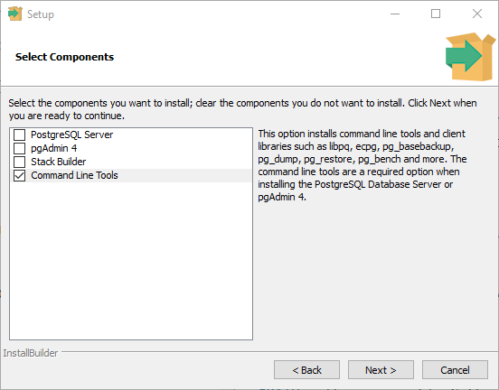

afterwards add the PATH:

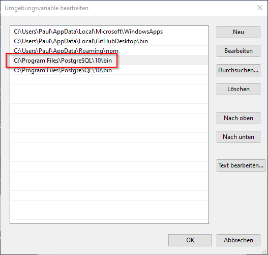

## Set up maven

Download the [maven](https://maven.apache.org/download.cgi) binary zip-archive.
Move the extracted files into a new folder named `C:/mvn`.

Check with `C:\mvn\bin\mvn.cmd --version` if maven is correctly installed.
This should return something similar to:

	PS C:\Users\username> C:\mvn\bin\mvn.cmd --version
    Apache Maven 3.8.4 (9b656c72d54e5bacbed989b64718c159fe39b537)
    Maven home: C:\mvn
    Java version: 1.8.0_312, vendor: Temurin, runtime: C:\Program Files\Eclipse Adoptium\jdk-8.0.312.7-hotspot\jre
    Default locale: de_DE, platform encoding: Cp1252
    OS name: "windows 10", version: "10.0", arch: "amd64", family: "windows"

## Configure maven `settings.xml` file

- Copy `settings.xml` file from `C:\work-metas\metasfresh\misc\dev-support\maven\settings.xml`
- (Create a folder named `.m2` in `C:/Users/username`)
- Paste `settings.xml` into `C:/Users/username/.m2/settings.xml`

## Compile the maven project

Run the following code in powershell:

    $start = Date

    $env:JAVA_HOME = "C:\Program Files\Eclipse Adoptium\jdk-8.0.312.7-hotspot"
    $mvnSettingsFile = "C:\Users\username\.m2\settings.xml"

    cd C:\work-metas\metasfresh\misc\parent-pom\
    C:\mvn\bin\mvn.cmd -T 2C -DskipTests --settings $mvnSettingsFile clean install

    cd C:\work-metas\metasfresh\misc\de-metas-common\
    C:\mvn\bin\mvn.cmd -T 2C -DskipTests --settings $mvnSettingsFile clean install

    cd C:\work-metas\metasfresh\backend\
    C:\mvn\bin\mvn.cmd -T 2C -DskipTests --settings $mvnSettingsFile clean install

    echo "Elapsed: "

    (Date) - $start

Info: Change your `JAVA_HOME` and `SettingsFile` PATH if necessary.

This might take a while to complete. In the end the output should be like this:

	Elapsed:

	Days              : 0
	Hours             : 0
	Minutes           : 18
	Seconds           : 34
	Milliseconds      : 570
	Ticks             : 11145705143
	TotalDays         : 0,012900121693287
	TotalHours        : 0,309602920638889
	TotalMinutes      : 18,5761752383333
	TotalSeconds      : 1114,5705143
	TotalMilliseconds : 1114570,5143

## Install Docker

Download and install [Docker](https://docs.docker.com/desktop/windows/install/) and follow the instructions to it set up.
You may need to restart your computer.

## Install JetBrains Toolbox and IntelliJ IDEA Ultimate

Optional download the [Toolbox](https://www.jetbrains.com//toolbox-app/) for additional features such as version or project management.
Download and install [IDEA Ultimate](https://www.jetbrains.com/idea/) for additional features.

Since the Ultimate Edition provides additional features for web/spring applications, it is used in this guide.
The Community Edition might work, for more information consult https://forum.metasfresh.org/t/development-environment-guide-with-intellij-and-docker-compose/1531.

## Configure maven in IntelliJ IDEA

Open IntelliJ Ultimate and go to `Customize -> All Settings`

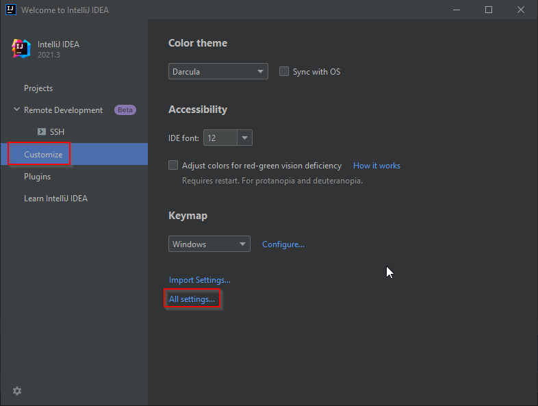

In `Build, Execution, Deployment -> Build Tools -> Maven` ensure the user settings file path is correct.

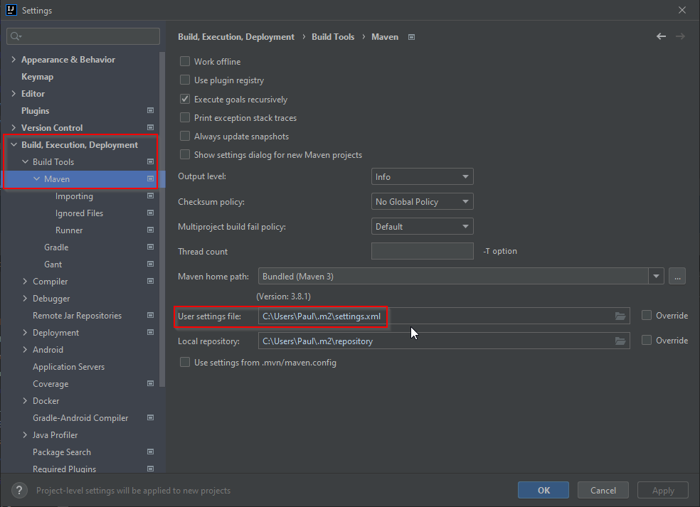

In Build, Execution, Deployment -> Build Tools -> Maven -> Importing ensure the following checkboxes are (un-)ticked:
Also choose the `JAVA_HOME` PATH in `JDK for Importer`

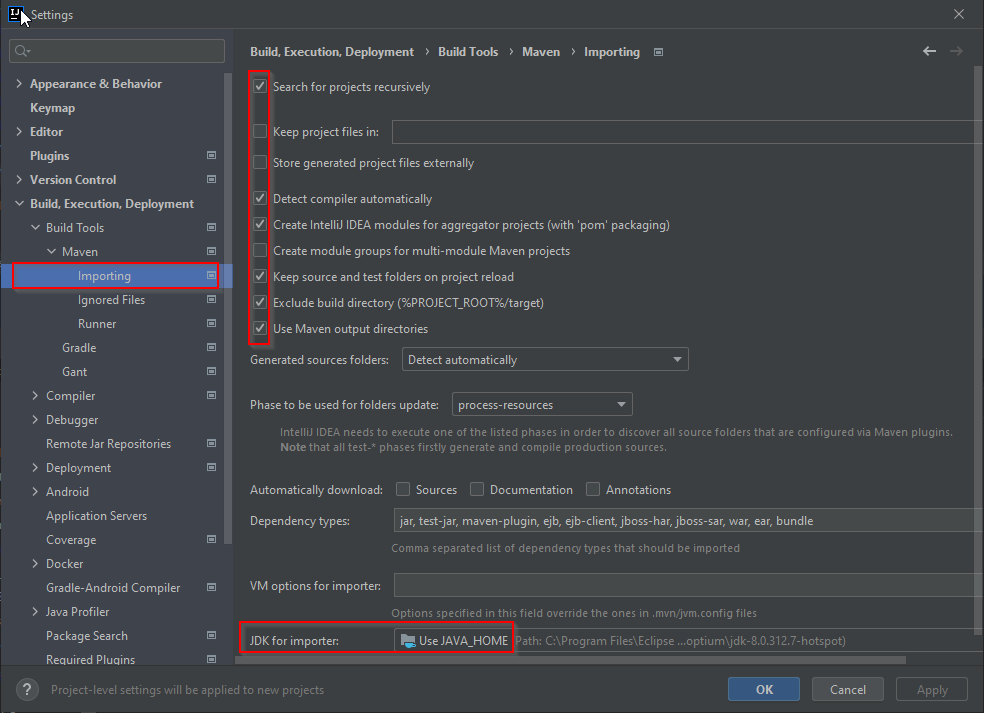

Open the work-metas project:
- choose `Projects -> Open`

  

- select the folder work-metas

  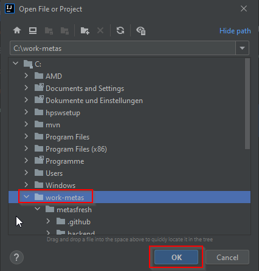

- once the project opened, close it again. The `work-metas` folder should now contain an `.idea` subfolder.

## Import metasfresh in IntelliJ IDEA

- Copy the `.idea` folder from `C:\work-metas\metasfresh\misc\dev-support\intellij-idea\`
  into  `C:\work-metas\`.

- Copy the `metasfresh` folder from `C:\work-metas\metasfresh\misc\dev-support\application.properties`
  into `C:\work-metas\`

## Configure IntelliJ IDEA

### Setup & JDK

Open the project again (see [here](#configure-maven-in-intellij-idea))
After opening the project IntelliJ will show multiple notifications in the bottom right corner. You should accept the following ones:

- Always download pre-built shared indexes
- Show run configurations in Services tool window (this will open the tool window)

Open `Project Structure` with <kbd>Ctrl</kbd>+<kbd>Alt</kbd>+<kbd>Shift</kbd>+<kbd>S</kbd>

- ensure under `SDK` the correct jdk home path is selected.

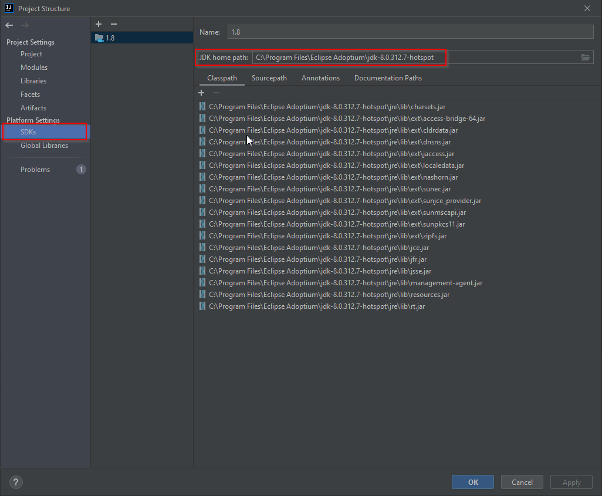

- under `Project` choose the correct Project SDK

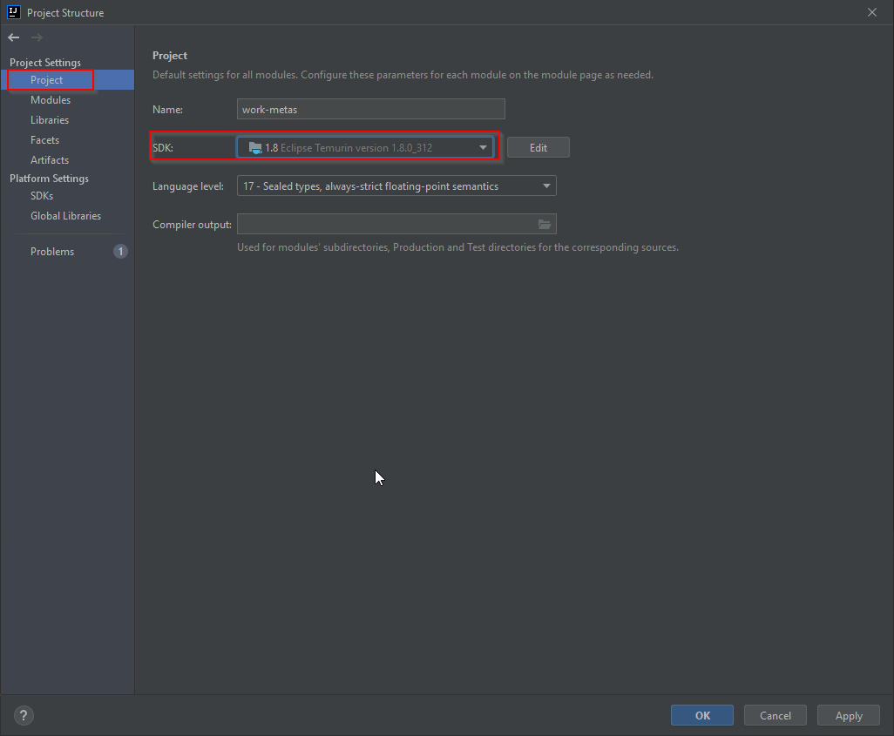

- confirm with `Apply` and `OK`

Open `Settings` with <kbd>Ctrl</kbd>+<kbd>Alt</kbd>+<kbd>S</kbd>

In `Build, Execution, Deployment -> Build Tools -> Maven -> Importing` select the JDK for `JDK for importer`.

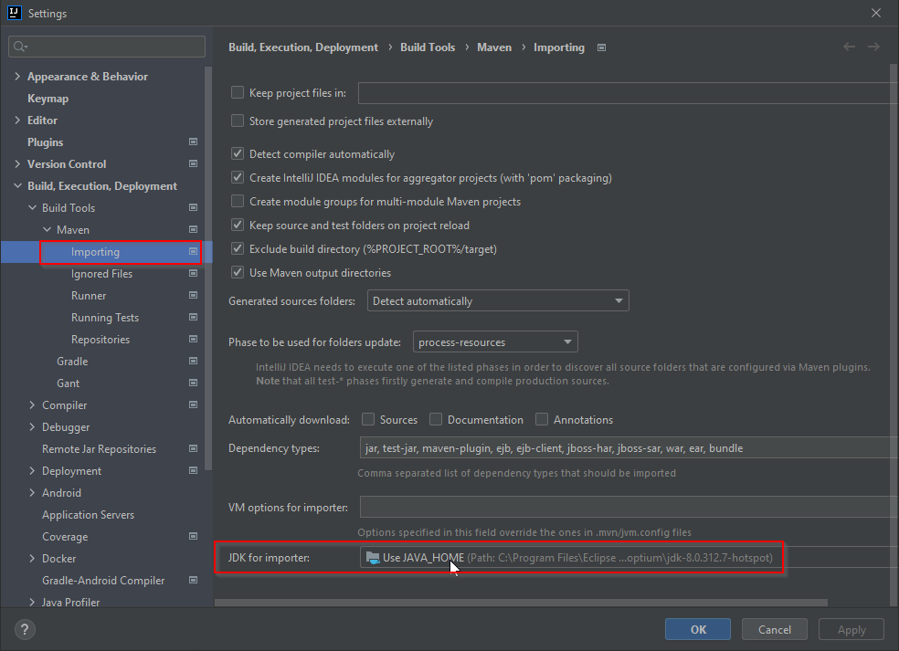

### pom files

In the `Project` tool window navigate to `metasfresh/backend/pom.xml`, right-click on the `pom.xml` and select `Add as a Maven project`.

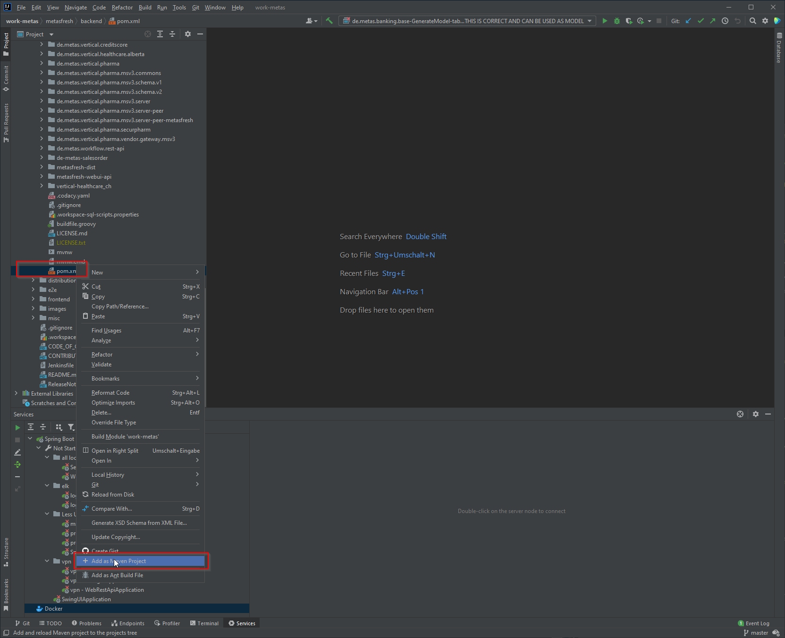

This step might take some time to complete and will throw an error, since we need to add these poms as well:

- metasfresh/misc/parent-pom/pom.xml
- metasfresh/misc/de-metas-common/pom.xml

(In case being asked to `Download pre-built shared indexes` choose `Always download`)

### Configure Services tool window

Press "4 squares" and disable `Configuration -> Type`

Press "plus", choose `Run configuration type` and add the following:

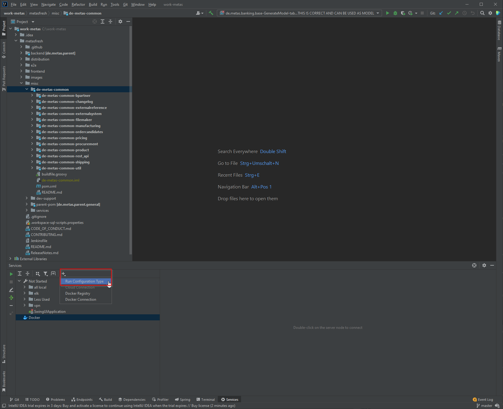

- `Docker`
- `npm`
- `Remote JVM Debug`

In the end you should see the following Run configurations:

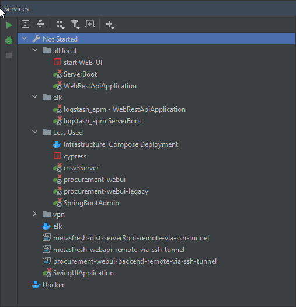

### Configure docker for IntelliJ

Open settings with <kbd>Ctrl</kbd>+<kbd>Alt</kbd>+<kbd>S</kbd>

In `Build, Execution, Deployment -> Docker` press <kbd>+</kbd>.
Then choose the option "Docker for Windows". Afterwards you can check if the connection was successful and hit `Apply`.

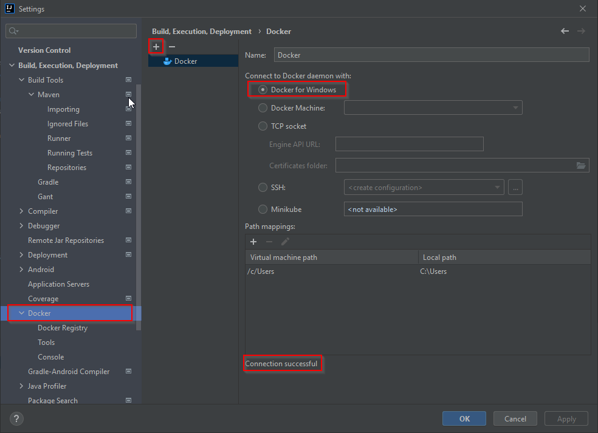

### Configure node js for IntelliJ

Open settings with <kbd>Ctrl</kbd>+<kbd>Alt</kbd>+<kbd>S</kbd>

In `Language & Frameworks -> Node.js` ensure that `Node interpreter` and `Package Manager` are the installed ones.

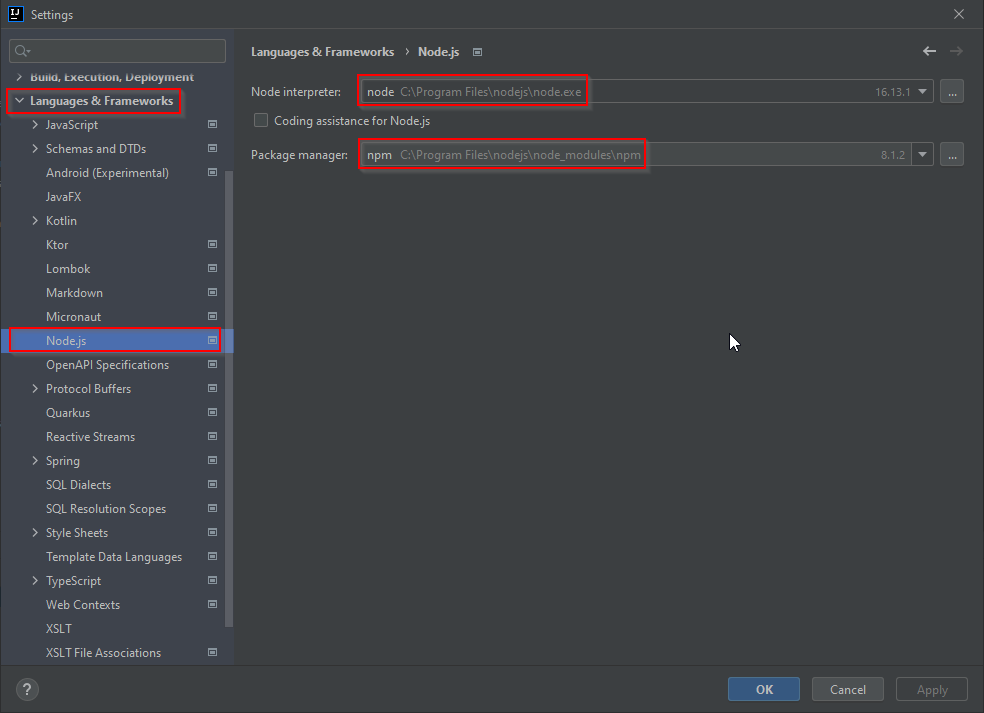

Press `Apply` and `Ok`

## Run metasfresh from IntelliJ

### Install infrastructure: postgres and rabbitMO in docker

In the `Services` tool window right click `Infrastructure: Compose Deployment` and choose run. In the end a message should indicate its success.

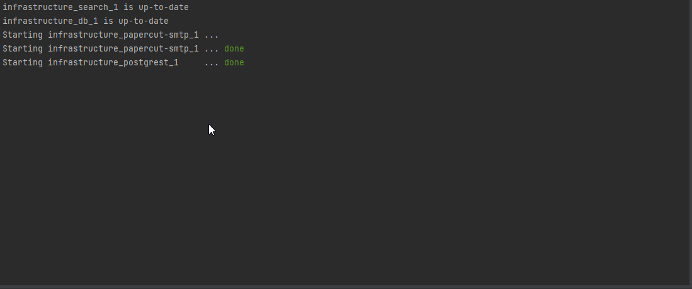

Info about the Docker Additional property error:
Docker sometimes enables the option to use Docker Compose V2. However, this needs to be disabled.

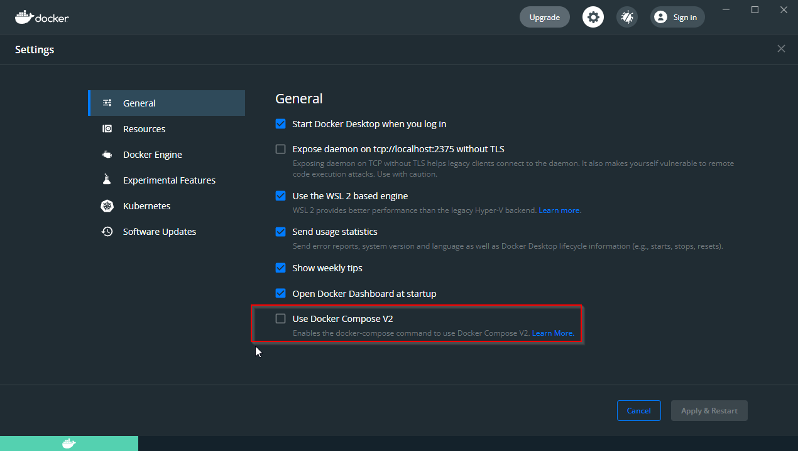

### Install dependencies for frontend

In the `Project` tool window select the file `metasfresh/frontend/package.json`, right click it and choose `run 'npm install'`.

Copy the file `metasfresh\frontend\config.js.dist` into `metasfresh\frontend\docker\nginx`.

## after_import.sql

Ask the metasfresh team for the after_import.sql file. This allows you to develop on metasfresh and create valid migration scripts.
You need to run this script manually (e.g. in Datagrip).

## Run configuration 'Run SQL Migrations'

This is necessary after every git pull from master. It updates all changes to your local database.

## Start metasfresh

In the `Services` tool window right-click the folder `all local` and select `run`. 2 Java classes and the frontend should start.
This should cover the basic installation process.

# Optional

- Use Eclipser plugin
There are some eclipse launcher files in the project. You could install eclipser plugin and
convert the files whenever you need them. Just right-click on a ".launch" file and you’ll find the `Convert with eclipser` option.

- Eclipse and IntelliJ IDEA interop
Eclipse can only find `// todo comments` if todo is in caps rage.
To do this you should go to `Settings -> Editor -> Live Templates` and add a new template as follows:

  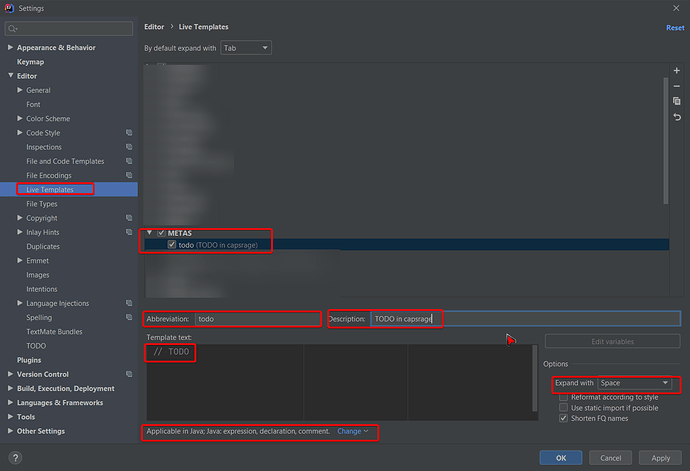

- Learn shortcuts and helpful information about your IDE.
