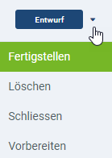

## Übersicht
Aktionen sind kontextabhängig und können von jedem Fenster aus gestartet werden. In jedem Fenster stehen folglich andere Aktionen zur Verfügung. 
In metasfresh gibt es drei verschiedene Aktionstypen:

### Allgemeine Aktionen (Aktionsmenü)
Diese Aktionen findest Du im Aktionsmenü.

### Schritte
1. Klicke auf  oder drücke `Strg + 1`, um das Aktionsmenü zu öffnen.
1. Klicke auf die gewünschte Aktion.

### Beispiel

---

### Belegverarbeitungsaktionen
Diese Aktionen findest Du in Belegen wie [Aufträgen](Auftrag_erfassen), [Bestellungen](Bestellung_erfassen) oder [Produktionsauftägen](NeuerProduktionsauftrag). Mit ihnen kannst Du den Belegstatus einstellen. 

### Schritte
1. Klicke auf  oder drücke `Strg + I`, um das Belegverarbeitungsmenü zu öffnen.
1. Klicke auf den gewünschten Status.

---

### Quick-Actions
Quick-Actions findest Du bei Prozessen wie [Kommissionierungen](Lieferung_kommissionieren), [Produktherstellungen](ProduktionFertigstellung), [Wareneingängen](Zu_Bestellung_Wareneingang_erstellen) usw. Du erkennst sie anhand des großen  oben rechts im Fenster.

### Schritte
- Klicke auf den Quick-Actions-Button oder drücke `Strg + U`, um die angezeigte Quick-Action auszuführen.
- Klicke auf das Kästchen neben dem Quick-Actions-Button oder drücke `Strg + L`, um das Quick-Actions-Menü zu öffnen und eine andere Aktion als die angezeigte zu wählen.
