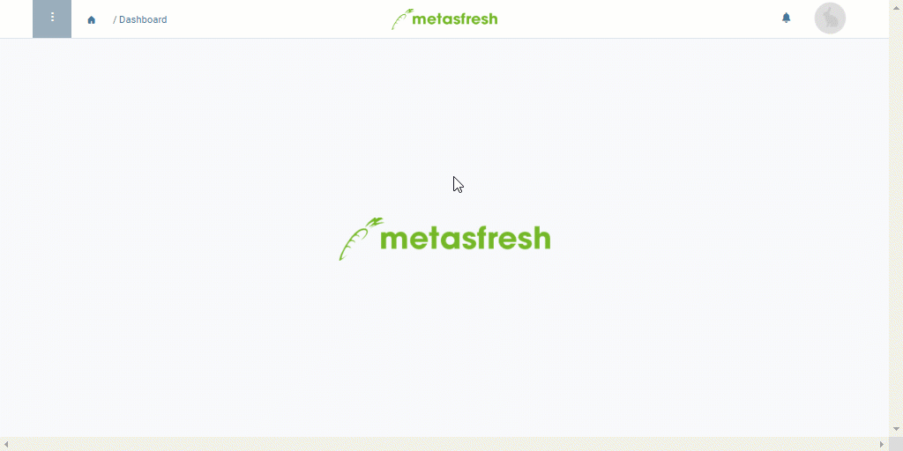

## Überblick
Wenn Du einen Kontakt aus Deiner Anrufliste erreicht und das Gespräch mit ihm/ihr geführt hast, kannst Du den [Anruf als getätigt markieren](Anrufplanung_Anruf_getaetigt), um so besser nachvollziehen zu können, welche Telefonate noch anstehen.

Ergibt sich aus einem Telefonat ein Kundenauftrag, kannst Du dies gleichfalls notieren und [unmittelbar aus dem Eintrag in die Auftragserfassung springen](Anrufplanung_Auftrag_erteilen).

Mithilfe der [Filterfunktion](Filterfunktion) kannst Du dir schnell einen Überblick über ausstehende Telefonate verschaffen.

## Voraussetzungen
- [Erzeuge eine automatische Anrufliste](Anruflisten_automatisch_generieren).

## Schritte

### Anrufliste filtern
[Gehe ins Menü](Menu) und öffne das Fenster "Anrufliste" und [verwende die Filterfunktion](Filterfunktion), um bestimmte Einträge in der Anrufliste schneller zu finden. Du kannst Anruflisten u.a. auch filtern nach:
 - erteilten und ***nicht*** erteilten Aufträgen sowie nach
 - getätigten und ***nicht*** getätigten Anrufen.

| Option | Kontrollkästchen |
| :--- | :---: |
| Klicke ein Mal auf das Kontrollkästchen, um es zu aktivieren und nach erteilten/getätigten Aufträgen/Anrufen zu suchen. |  |
| Klicke ein zweites Mal darauf, um nach ***nicht*** erteilten/getätigten Aufträgen/Anrufen zu suchen. |  |
| Klicke auf `(clear)` rechts neben dem aktivierten Kontrollkästchen, um es wieder zu deaktivieren. |     |

## Beispiel

