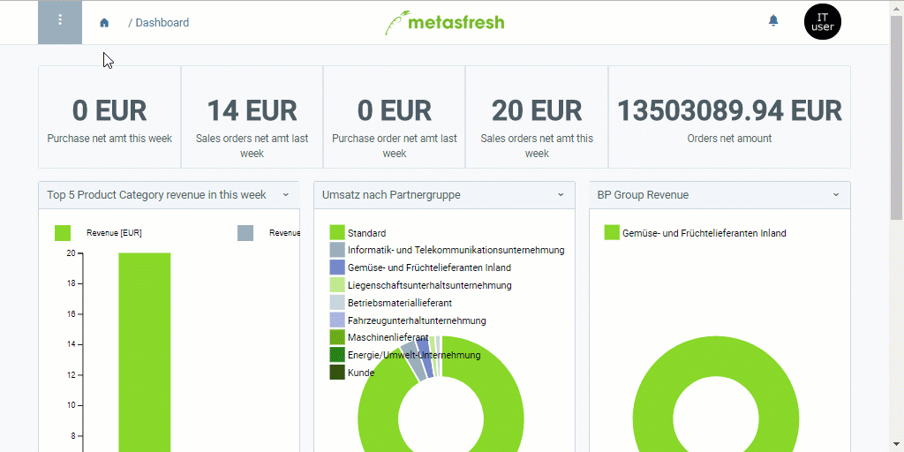

## Überblick
Eine Warenverteilung (oder ein *Distributionsnetz*) für Leergebinde ist notwendig, wenn leere Gebinde, die nach Entnahme der in ihnen enthaltenen Produkte anfallen, von einem Lager zur Lagerung in ein anderes (hier "Leergebindelager") bewegt werden sollen. Diese Bewegung wird durch die Warenverteilung abgebildet.

## Voraussetzungen
Zur Einrichtung der automatischen Warenverteilung für Leergebinde benötigst Du:

1. ein Hauptlager (bereits standardmäßig in metasfresh enthalten).
1. einen Lieferweg (bereits standardmäßig in metasfresh enthalten).
1. ein [Leergebindelager](Leergebindelager_anlegen).

## Schritte
1. [Gehe ins Menü](Menu) und öffne das Fenster "Distributions Konfiguration".
1. [Lege einen neuen Distributionskonfigurationseintrag an](Neuer_Datensatz_Fenster_Webui).
1. Benenne den Distributionskonfigurationseintrag im Feld **Name**, z.B. "Autom. Gebindedistribution".
1. Trage eine **Nr.** ein.
1. Setze ein Häkchen bei **IsHUDestroyed**.
1. Gehe zur Registerkarte "Network Line" unten auf der Seite und klicke auf . Es öffnet sich ein Overlay-Fenster.
1. Wähle im Feld **Source Warehouse** ein Ausgangslager aus, z.B. *Hauptlager*.
1. Wähle im Feld **Target Warehouse** ein Ziellager aus, z.B. *Leergebindelager*.
1. Wähle einen **Lieferweg** aus, z.B. *Eigentransport*.
1. Klicke auf "Bestätigen", um das Overlay-Fenster zu schließen und die Netzwerkzeile zur Liste hinzuzufügen.

## Beispiel

