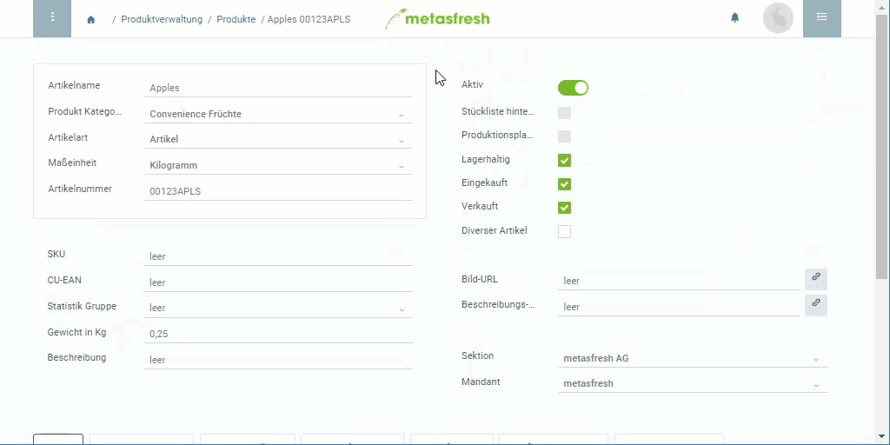

## Überblick
Ein Produkt ist eine [Verbrauchereinheit (CU)](Handling_Unit_System), welche in größeren Mengen in einem [Gebinde (TU)](Handling_Unit_System) verpackt werden kann. Die Art des zu verwendenden Gebindes wird mittels der [Packvorschrift](Packvorschrift_erstellen) bestimmt.

## Schritte
1. Öffne den Eintrag eines bestehenden [Produktes](Menu) bzw. [lege ein neues an](NeuesProdukt).
1. Gehe zur Registerkarte "CU-TU Zuordnung" unten auf der Seite und klicke auf . Es öffnet sich ein Overlay-Fenster.
1. Wähle eine **Packvorschrift Position** aus, z.B. *IFCO*.
1. ***a)*** Trage eine bestimmte, immer gleichbleibende **Menge** ein, die in das Gebinde gepackt werden soll. Die **Maßeinheit** ist immer die Bestandsmengeneinheit des Produktes.  
***b)*** Bei unbekannter bzw. wechselnder Menge setze ein Häkchen bei **Unbestimmte Kapazität**.
1. Stelle ein **Gültig ab** Datum ein.
 >**Hinweis:** Liegt das Datum in der *Vergangenheit*, gilt die Packvorschrift *ab sofort*. Liegt es in der *Zukunft*, gilt sie *erst ab diesem Datum*. metasfresh orientiert sich am zugesagten Termin in Auftrag oder Bestellung und schlägt dementsprechend die jeweils gültige Packvorschrift automatisch vor.

1. ***Optional:*** Gib einen [**Geschäftspartner**](Neuer_Geschaeftspartner) an, wenn diese Packvorschrift nur für diesen einen Partner aktiviert werden soll.
1. Klicke auf "Bestätigen", um das Overlay-Fenster zu schließen und die Zuordnung zur Liste hinzuzufügen.
 >**Hinweis:** Wiederhole die Schritte 2 bis 7, um weitere Zuordnungen mit anderen Packvorschriften zur Liste hinzuzufügen.

## Nächste Schritte
- [Knüpfe die Packvorschrift an einen Preis](Packvorschrift_Preis_anhaengen).

## Beispiel

