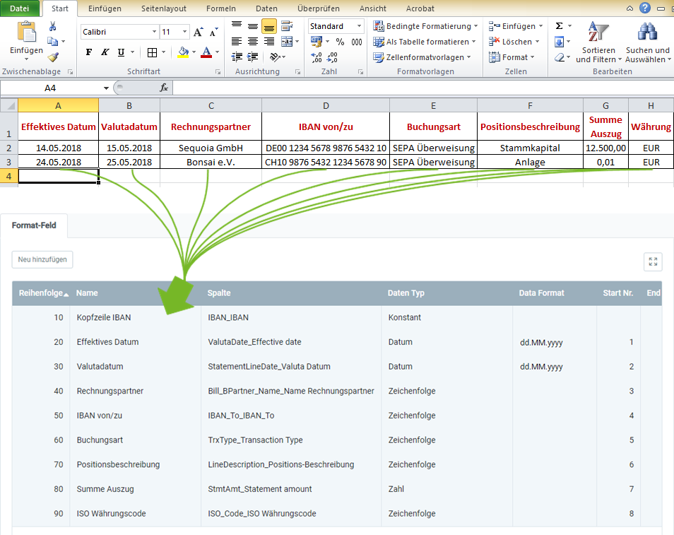

## Überblick
Für den Bankauszugsdatenimport benötigst Du ein Importformat, in dem die **DB-Tabelle** *Import - Bankauszug* eingestellt ist.

In dem folgenden Beispiel wird der Dateninhalt aus einer Datei einer Tabellenkalkulationssoftware (hier z.B. eine *Excel*-Datei vor der [Konvertierung in eine CSV- oder TXT-Datei](Importdatei_nuetzliche_Hinweise)) dem Importformat für Bankauszugsdaten gegenübergestellt:

### Erläuterungen zum Beispiel
- Die **Spalte A** der Excel-Tabelle (*Effektives Datum*) steht an erster Stelle, d.h. das entsprechende Formatfeld bekommt die **Start-Nr. 1**. Demzufolge erhält das Formatfeld für die **Spalte B** die **Start-Nr. 2** usw.  Die **Reihenfolge** der Formatfelder ist dabei unerheblich.
 >**Hinweis:** metasfresh erwartet ***keine Spaltennamen*** in der Importdatei. Alleine die ***Position*** der Spalte muss mit der Startnummer übereinstimmmen.

- Der **Name** des Formatfeldes ist frei wählbar und muss nicht mit der Benennung der Spalte aus der Importdatei übereinstimmen.
- Die **Spalte** des Formatfeldes bestimmt, wohin metasfresh den Inhalt der Spalte aus der Importdatei übertragen soll.
- Der **Datentyp** bestimmt, ob es sich bei den Importdaten z.B. um eine *Zeichenfolge* oder *Zahl* handelt.
- Das erste Formatfeld "Kopfzeile IBAN" in der Liste mit dem Datentyp *Konstant* verfügt über keine Startnummer und muss daher nicht in der Importdatei enthalten sein. Die im Feld in der Spalte **Konstante** eingetragene IBAN wird immer als Transaktionskonto des Unternehmens für Zahlungsein- und -ausgänge verwendet.

### Einige nützliche Hinweise
Die Angabe der Pflichtfelder sowie die vorausgesetzte Zuordnung der IBANs zu existierenden Bankkonten sind unerlässlich für einen erfolgreichen Datenimport!

| Pflichtfeld | Feldname | Beispiel | Hinweis |
| :---: | :---: | :--- | :--- |
| X | Kopfzeile IBAN | DE00 1234 5678 9876 5432 10 | Die IBAN des Kontos, auf das Zahlungsein- und -ausgänge gebucht werden (üblicherweise z.B. das Unternehmenskonto), wird hier als Konstante angegeben. Sie muss daher nicht in der Importdatei enthalten sein. |
|  | Effektives Datum | 14.05.2018 | Das Datum, ab dem der Geldbetrag effektiv zur Verfügung steht. |
|  | Valutadatum | 15.05.2018 | Wertstellungsdatum |
|  | Rechnungspartner | Sequoia GmbH | Der Name des Rechnungspartners |
| X | IBAN von/zu | CH10 9876 5432 1234 5678 90 | Die IBAN des Empfänger- oder Zahlungskontos |
|  | Buchungsart | SEPA Überweisung | Buchungsart der Auszugsposition |
|  | Positionsbeschreibung | Stammkapital | Beschreibung der Auszugsposition |
| X | Summe Auszug | 12.500,00 | Betrag der Auszugsposition |
| X | ISO Währungscode | EUR | Dreistelliger Buchstabencode (gem. ISO 4217) |

## Nächste Schritte
- [Bankauszugsdaten importieren](Bankauszugsdaten_importieren).
