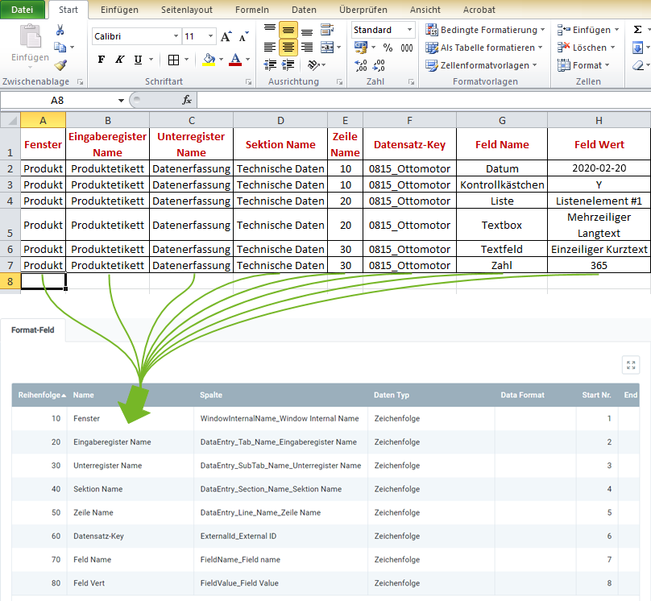

## Überblick
Für den Import [benutzerdefinierter Dateneingaben](Benutzerdefinierte_Registerkarte_anlegen) benötigst Du ein Importformat, in dem die **DB-Tabelle** *Import Data Entry Record* eingestellt ist.

In dem folgenden Beispiel wird der Dateninhalt aus einer Datei einer Tabellenkalkulationssoftware (hier z.B. eine *Excel*-Datei vor der [Konvertierung in eine CSV- oder TXT-Datei](Importdatei_nuetzliche_Hinweise)) dem Importformat für benutzerdefinierte Dateneingaben gegenübergestellt:

### Erläuterungen zum Beispiel
- Die **Spalte A** der Excel-Tabelle (*Fenster*) steht an erster Stelle, d.h. das entsprechende Formatfeld bekommt die **Start-Nr. 1**. Demzufolge erhält das Formatfeld für die **Spalte B** die **Start-Nr. 2** usw.  Die **Reihenfolge** der Formatfelder ist dabei unerheblich.
 >**Hinweis:** metasfresh erwartet ***keine Spaltennamen*** in der Importdatei. Alleine die ***Position*** der Spalte muss mit der Startnummer übereinstimmmen.

- Der **Name** des Formatfeldes ist frei wählbar und muss nicht mit der Benennung der Spalte aus der Importdatei übereinstimmen.
- Die **Spalte** des Formatfeldes bestimmt, wohin metasfresh den Inhalt der Spalte aus der Importdatei übertragen soll.
- Der **Datentyp** bestimmt, ob es sich bei den Importdaten z.B. um eine *Zeichenfolge* oder *Zahl* handelt.

### Einige nützliche Hinweise
Die Angabe der Pflichtfelder ist unerlässlich für einen erfolgreichen Datenimport!

| Pflichtfeld | <abbr title="Bewege den Mauszeiger über den Feldnamen, um den entspr. Spaltennamen zu sehen.">Feldname</abbr> | Beispiel | Hinweis |
| :---: | :---: | :--- | :--- |
| X | <abbr title="WindowInternalName_Window Internal Name">Fenster</abbr> | Produkt | Systeminterner Name des Eingabefensters. (Im Zweifel beim Systemadministrator erfragen.) |
| X | <abbr title="DataEntry_Tab_Name_Eingaberegister Name">Eingaberegister Name</abbr> | Produktetikett | Name der benutzerdefinierten Registerkarte |
| X | <abbr title="DataEntry_SubTab_Name_Unterregister Name">Unterregister Name</abbr> | Datenerfassung | Name des Unterregisters |
|  | <abbr title="DataEntry_Section_Name_Sektion Name">Sektion Name</abbr> | Technische Daten | Name der Sektion |
|  | <abbr title="DataEntry_Line_Name_Zeile Name">Zeile Name</abbr> | •&nbsp;10  •&nbsp;20  •&nbsp;... | Reihenfolge der Zeile |
| X | <abbr title="ExternalId_External ID">Datensatz-Key</abbr> | 0815_Ottomotor | Suchschlüssel des Dateneintrages |
| X | <abbr title="FieldName_Field name">Feld Name</abbr> | Datum | Name des Feldes  (**Wichtiger Hinweis:** Bei mehreren Feldern mit demselben Namen ***müssen*** der Sektionsname und/oder die Reihenfolge der Zeile angegeben werden!) |
|  | <abbr title="FieldValue_Field Value">Feld Wert</abbr> | 2020-02-20 | Wert bzw. Inhalt des Feldes.  Für folgende Felddatentypen (siehe [Erweiterte Dateneingabe - Feld](Sektionszeilen_Felder_hinzufuegen)) können folgende Werte angegeben werden:  •&nbsp;Datum: `JJJJ-MM-TT` (gem. ISO 8601)  •&nbsp;Kontrollkästchen: Y (`= aktiviert`), N (`= deaktiviert`)  •&nbsp;Liste: `Name des Listenelementes`  •&nbsp;Textbox: `Text (mehrzeilig)`  •&nbsp;Textfeld: `Text (einzeilig)`  •&nbsp;Zahl: `Zahlenwert`   Wird kein Feldwert angegeben, wird der ggf. vorhandene Feldinhalt in dem Eingaberegister gelöscht. |

## Nächste Schritte
- [Benutzerdefinierte Dateneingaben importieren](Dateneingaben_importieren).
