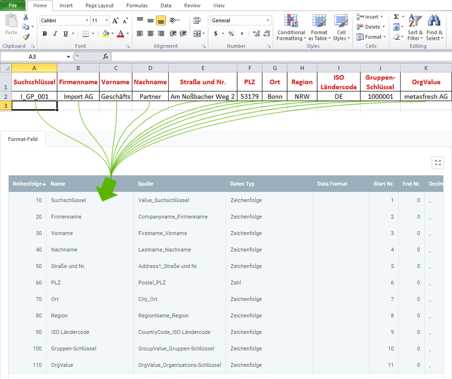

## Überblick
Für den Geschäftspartnerdatenimport benötigst Du ein Importformat, in dem die **DB-Tabelle** *Import - Geschäftspartner* eingestellt ist.

In dem folgenden Beispiel wird der Dateninhalt aus einer Datei einer Tabellenkalkulationssoftware (hier z.B. eine *Excel*-Datei vor der [Konvertierung in eine CSV- oder TXT-Datei](Importdatei_nuetzliche_Hinweise)) dem Importformat für Geschäftspartnerdaten gegenübergestellt:

### Erläuterungen zum Beispiel
- Die **Spalte A** der Excel-Tabelle (*Suchschlüssel*) steht an erster Stelle, d.h. das entsprechende Formatfeld bekommt die **Start-Nr. 1**. Demzufolge erhält das Formatfeld für die **Spalte B** die **Start-Nr. 2** usw.  Die **Reihenfolge** der Formatfelder ist dabei unerheblich.
 >**Hinweis:** metasfresh erwartet ***keine Spaltennamen*** in der Importdatei. Alleine die ***Position*** der Spalte muss mit der Startnummer übereinstimmmen.

- Der **Name** des Formatfeldes ist frei wählbar und muss nicht mit der Benennung der Spalte aus der Importdatei übereinstimmen.
- Die **Spalte** des Formatfeldes bestimmt, wohin metasfresh den Inhalt der Spalte aus der Importdatei übertragen soll.
- Der **Datentyp** bestimmt, ob es sich bei den Importdaten z.B. um eine *Zeichenfolge* oder *Zahl* handelt.

### Einige nützliche Hinweise
Die Angabe der Pflichtfelder ist unerlässlich für einen erfolgreichen Datenimport!

| Pflichtfeld | <abbr title="Bewege den Mauszeiger über den Feldnamen, um den entspr. Spaltennamen zu sehen.">Feldname</abbr> | Beispiel | Hinweis |
| :---: | :--- | :--- | :--- |
| X | <abbr title="BPValue_Nr">Suchschlüssel</abbr> | I_GP_001 | Suchschlüssel des Geschäftspartners (eindeutige alphanumerische Zeichenfolge) |
| X | <abbr title="Companyname_Firmenname">Firmenname</abbr> | Import AG | Firmenname |
| X | <abbr title="Name_Name">Name</abbr> | Bob Ross | Geschäftspartnername (bei Einzelpersonen) |
| (X) | •&nbsp;<abbr title="Firstname_Vorname">Vorname</abbr>  •&nbsp;<abbr title="Lastname_Nachname">Nachname</abbr> | •&nbsp;Johann  •&nbsp;Schmidt | Die Angabe ist nur im Zusammenhang mit zu importierenden **Kontakten** erforderlich. |
| (X) | <abbr title="CountryCode_ISO Ländercode">ISO-Ländercode</abbr> | DE | DE = **De**utschland  Zweistelliger Buchstabencode (gem. ISO 3166-1 Alpha-2).  Die Angabe ist nur im Zusammenhang mit zu importierenden Adressen erforderlich.  (*Den ISO-Ländercode kannst Du unter dem Menüpunkt "[Land, Region](Menu)" nachschauen.*) |
| X | <abbr title="GroupValue_Gruppen-Schlüssel">Gruppen-Schlüssel</abbr> | •&nbsp;Standard  •&nbsp;1000001 | **Suchschlüssel** der Geschäftspartnergruppe.  ***Achtung:*** Nicht der Name!  Lege die Geschäftspartnergruppe erst in metasfresh an und verwende dann hier ihren Suchschlüssel.  (*Den Suchschlüssel kannst Du unter dem Menüpunkt "[Geschäftspartnergruppen](Menu)" im jeweiligen Eintrag nachschauen.*) |
|  | <abbr title="RegionName_Region">Region</abbr> | •&nbsp;NRW  •&nbsp;AZ | NRW = **N**ord**r**hein-**W**estfalen  AZ = **A**ri**z**ona  (*Das Akronym bzw. den **Namen** einer Region kannst Du unter dem Menüpunkt "[Land, Region](Menu)" unter der Registerkarte "Region" des jeweiligen Ländereintrages nachschauen.*) |
|  | <abbr title="OrgValue_Organisations-Schlüssel">OrgValue</abbr> | metasfresh AG | **Suchschlüssel** der Organisation.  ***Achtung:*** Nicht der Name!  (*Den Suchschlüssel kannst Du unter dem Menüpunkt "[Organisation](Menu)" nachschauen.*) |
|  | <abbr title="Siehe Beispiele &#8594;">Standortdaten</abbr> | •&nbsp;<abbr title="Address1_Straße und Nr.">Straße und Nr.</abbr>  •&nbsp;<abbr title="Postal_PLZ">PLZ</abbr>  •&nbsp;<abbr title="City_Ort">Ort</abbr>  •&nbsp;<abbr title="RegionName_Region">Region</abbr>  •&nbsp;<abbr title="CountryCode_ISO Ländercode">ISO-Ländercode</abbr> | Damit [Standortdaten](Adresse_erfassen_Tab) importiert werden können, müssen mindestens **Ort** und **ISO Ländercode** angegeben sein.   Standortdaten wie **Straße und Nr.**, **PLZ** oder **Region** werden nur importiert, wenn sowohl **Ort** als auch **ISO Ländercode** vorhanden sind. |
|  | <abbr title="GLN_GLN">Global Location Number</abbr> (GLN) | 1234567890128 | Zum Import einer **GLN** müssen sowohl **Ort** als auch **ISO-Ländercode** vorhanden sein. |
|  | <abbr title="URL_URL">Webadresse</abbr> (URL) | <a href="https://metasfresh.com/" title="metasfresh Homepage" target="blank"><strong>https://</strong>metasfresh.com/</a> | Damit eine **URL** nach dem Import funktioniert, muss diese mit dem Internetprotokollakronym beginnen (z.B. `https://`). |

## Nächste Schritte
- [Geschäftspartnerdaten importieren](GPartnerdaten_importieren).
