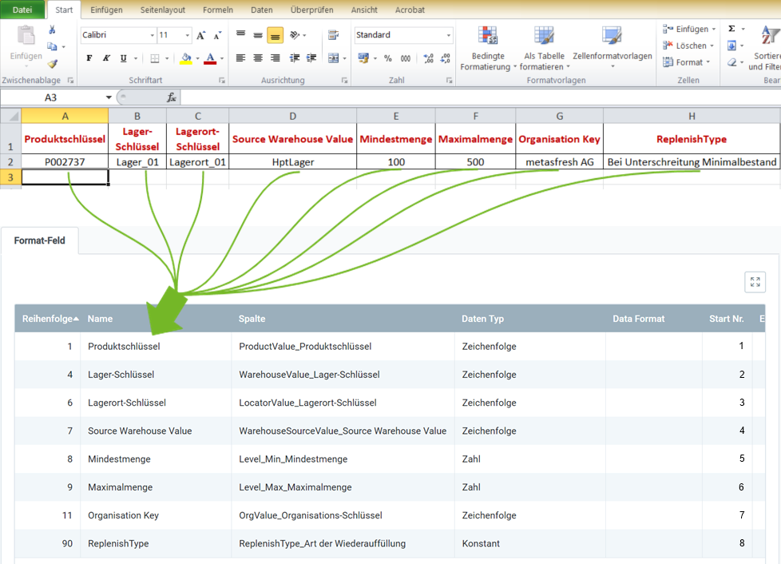

## Überblick
Für den Nachbestelldatenimport benötigst Du ein Importformat, in dem die **DB-Tabelle** *Import Replenishment* eingestellt ist.

In dem folgenden Beispiel wird der Dateninhalt aus einer Datei einer Tabellenkalkulationssoftware (hier z.B. eine *Excel*-Datei vor der [Konvertierung in eine CSV- oder TXT-Datei](Importdatei_nuetzliche_Hinweise)) dem Importformat für Nachbestelldaten gegenübergestellt:

### Erläuterungen zum Beispiel
- Die **Spalte A** der Excel-Tabelle (*Produktschlüssel*) steht an erster Stelle, d.h. das entsprechende Formatfeld bekommt die **Start-Nr. 1**. Demzufolge erhält das Formatfeld für die **Spalte B** die **Start-Nr. 2** usw.  Die **Reihenfolge** der Formatfelder ist dabei unerheblich.
 >**Hinweis:** metasfresh erwartet ***keine Spaltennamen*** in der Importdatei. Alleine die ***Position*** der Spalte muss mit der Startnummer übereinstimmmen.

- Der **Name** des Formatfeldes ist frei wählbar und muss nicht mit der Benennung der Spalte aus der Importdatei übereinstimmen.
- Die **Spalte** des Formatfeldes bestimmt, wohin metasfresh den Inhalt der Spalte aus der Importdatei übertragen soll.
- Der **Datentyp** bestimmt, ob es sich bei den Importdaten z.B. um eine *Zeichenfolge* oder *Zahl* handelt.

### Einige nützliche Hinweise

| Pflichtfeld | <abbr title="Bewege den Mauszeiger über den Feldnamen, um den entspr. Spaltennamen zu sehen.">Feldname</abbr> | Beispiel | Hinweis |
| :---: | :---: | :--- | :--- |
| X | <abbr title="ProductValue_Produktschlüssel">Produktschlüssel</abbr> | P002737 | **Suchschlüssel** des Produktes für die Nachbestellung (alphanumerische Zeichenfolge) |
| X | <abbr title="WarehouseValue_Lager-Schlüssel">Lager-Schlüssel</abbr> | Lager_01 | **Suchschlüssel** des Lagers (alphanumerische Zeichenfolge) |
| X | <abbr title="ReplenishType_Art der Wiederauffüllung">ReplenishType</abbr> | *Bei Unterschreitung Minimalbestand* | Art der Wiederauffüllung |
| X | <abbr title="Level_Min_Mindestmenge">Mindestmenge</abbr> | 100 | Minimaler Bestand für das Produkt |
| X | <abbr title="Level_Max_Maximalmenge">Maximalmenge</abbr> | 500 | Maximaler Bestand für das Produkt |
|  | <abbr title="WarehouseSourceValue_Source Warehouse Value">Source Warehouse Value</abbr> | HptLager | **Suchschlüssel** des Ausgangslagers |
|  | <abbr title="OrgValue_Organisations-Schlüssel">Organisation Key</abbr>  (=OrgValue) | metasfresh AG | **Suchschlüssel** der Organisation.  ***Achtung:*** Nicht der Name!  (*Den Suchschlüssel kannst Du unter dem Menüpunkt "[Organisation](Menu)" nachschauen.*) |

## Nächste Schritte
- [Nachbestelldaten importieren](Nachbestelldaten_importieren).
