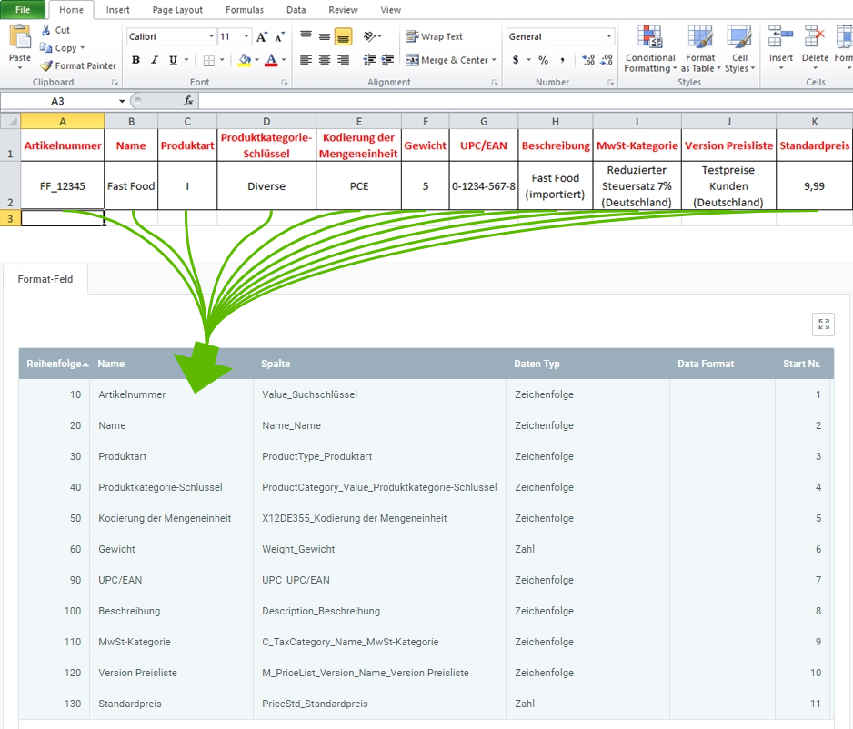

## Überblick
Für den Produktdatenimport benötigst Du ein Importformat, in dem die **DB-Tabelle** *Import - Produkt* eingestellt ist.

In dem folgenden Beispiel wird der Dateninhalt aus einer Datei einer Tabellenkalkulationssoftware (hier z.B. eine *Excel*-Datei vor der [Konvertierung in eine CSV- oder TXT-Datei](Importdatei_nuetzliche_Hinweise)) dem Importformat für Produktdaten gegenübergestellt:

### Erläuterungen zum Beispiel
- Die **Spalte A** der Excel-Tabelle (*Artikelnummer*) steht an erster Stelle, d.h. das entsprechende Formatfeld bekommt die **Start-Nr. 1**. Demzufolge erhält das Formatfeld für die **Spalte B** die **Start-Nr. 2** usw.  Die **Reihenfolge** der Formatfelder ist dabei unerheblich.
 >**Hinweis:** metasfresh erwartet ***keine Spaltennamen*** in der Importdatei. Alleine die ***Position*** der Spalte muss mit der Startnummer übereinstimmmen.

- Der **Name** des Formatfeldes ist frei wählbar und muss nicht mit der Benennung der Spalte aus der Importdatei übereinstimmen.
- Die **Spalte** des Formatfeldes bestimmt, wohin metasfresh den Inhalt der Spalte aus der Importdatei übertragen soll.
- Der **Datentyp** bestimmt, ob es sich bei den Importdaten z.B. um eine *Zeichenfolge* oder *Zahl* handelt.

### Einige nützliche Hinweise
Die Angabe der Pflichtfelder ist unerlässlich für einen erfolgreichen Datenimport!

| Pflichtfeld | Feldname | Beispiel | Hinweis |
| :---: | :---: | :--- | :--- |
| X | Artikelnummer | FF_12345 | **Suchschlüssel** des Produktes (alphanumerische Zeichenfolge) |
| X | Produktart | I | I = Artikel (engl.: _**I**tem_)  E = **E**rfolgskonten  R = **R**essource |
| X | Produktkategorie-Schlüssel | •&nbsp;Diverse  •&nbsp;16 | **Suchschlüssel** der Produktkategorie.  ***Achtung:*** Nicht der Name!  (*Den Suchschlüssel kannst Du unter dem Menüpunkt "[Produkt Kategorie](Menu)" nachschauen.*) |
|  | Kodierung der Mengeneinheit	| PCE | PCE = Stück (Stk, engl.: _**P**ie**ce**_)  (*Die Kodierungen der Mengeneinheiten kannst Du unter dem Menüpunkt "[Maßeinheit](Menu)" nachschauen.*) |
|  | MwSt-Kategorie | Reduzierter Steuersatz 7% (Deutschland) | Die MwSt-Kategorie kannst Du unter dem Menüpunkt "[Steuer Kategorie](Menu)" nachschauen. |
|  | Version Preisliste | Testpreise Kunden (Deutschland) | Die Preislistenversion kannst Du unter dem Menüpunkt "[Preisliste](Menu)" nachschauen. |

## Nächste Schritte
- [Produktdaten importieren](Produktdaten_importieren).
