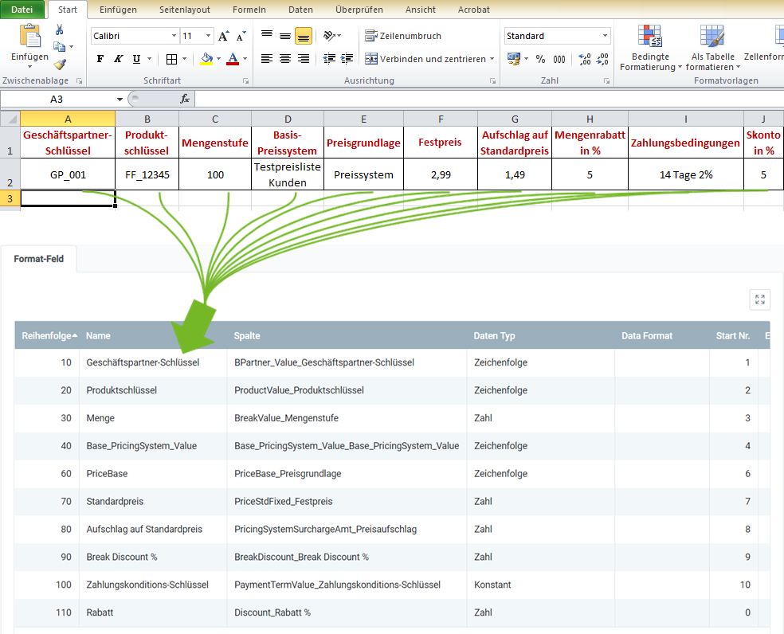

## Überblick
Für den Import von Rabattschemata benötigst Du ein Importformat, in dem die **DB-Tabelle** *I_DiscountSchema* eingestellt ist.

In dem folgenden Beispiel wird der Dateninhalt aus einer Datei einer Tabellenkalkulationssoftware (hier z.B. eine *Excel*-Datei vor der [Konvertierung in eine CSV- oder TXT-Datei](Importdatei_nuetzliche_Hinweise)) dem Importformat für Rabattschemata gegenübergestellt:

### Erläuterungen zum Beispiel
- Die **Spalte A** der Excel-Tabelle (*Geschäftspartner-Schlüssel*) steht an erster Stelle, d.h. das entsprechende Formatfeld bekommt die **Start-Nr. 1**. Demzufolge erhält das Formatfeld für die **Spalte B** die **Start-Nr. 2** usw.  Die **Reihenfolge** der Formatfelder ist dabei unerheblich.
 >**Hinweis:** metasfresh erwartet ***keine Spaltennamen*** in der Importdatei. Alleine die ***Position*** der Spalte muss mit der Startnummer übereinstimmmen.

- Der **Name** des Formatfeldes ist frei wählbar und muss nicht mit der Benennung der Spalte aus der Importdatei übereinstimmen.
- Die **Spalte** des Formatfeldes bestimmt, wohin metasfresh den Inhalt der Spalte aus der Importdatei übertragen soll.
- Der **Datentyp** bestimmt, ob es sich bei den Importdaten z.B. um eine *Zeichenfolge* oder *Zahl* handelt.

### Einige nützliche Hinweise
Die Angabe der Pflichtfelder ist unerlässlich für einen erfolgreichen Datenimport!

| Pflichtfeld | <abbr title="Bewege den Mauszeiger über den Feldnamen, um den entspr. Spaltennamen zu sehen.">Feldname</abbr> | Beispiel | Hinweis |
| :---: | :---: | :--- | :--- |
| X | <abbr title="BPartner_Value_Geschäftspartner-Schlüssel">Geschäftspartner-Schlüssel</abbr> | GP_001 | Geschäftspartnernummer (eindeutige alphanumerische Zeichenfolge) |
| X | <abbr title="ProductValue_Produktschlüssel">Produktschlüssel</abbr> | FF_12345 | **Suchschlüssel** des Produktes (alphanumerische Zeichenfolge) |
| | <abbr title="BreakValue_Mengenstufe">Mengenstufe</abbr> | 100 | **Mengenstufe** des Produktes, ab der eine Preiskondition gilt. |
| | <abbr title="Base_PricingSystem_Value_Base_PricingSystem_Value">Basis-Preissystem</abbr> | Testpreisliste Kunden | **Suchschlüssel** des Preissystems, das als Grundlage für die Preisbestimmung dient. |
| | <abbr title="PriceBase_Preisgrundlage">Preisgrundlage</abbr> | •&nbsp;Preissystem  •&nbsp;Festpreis | Preisgrundlage kann entweder das Preissystem oder ein abweichend bestimmter Festpreis sein. |
| | <abbr title="PriceStdFixed_Festpreis">Festpreis</abbr> | 2,99 | **Festpreis**. Die Angabe ist nur erforderlich, sofern *Festpreis* als **Preisgrundlage** angegeben ist. |
| | <abbr title="PricingSystemSurchargeAmt_Preisaufschlag">Aufschlag auf Standardpreis</abbr> | 1,49 | Preisaufschlag. Die Angabe ist nur erforderlich, sofern *Preissystem* als **Preisgrundlage** angegeben ist. |
| | <abbr title="BreakDiscount_Break Discount %">Mengenrabatt in %</abbr> | 5 | **Mengenrabatt** in Prozent |
| | <abbr title="PaymentTermValue_Zahlungskonditions-Schlüssel">Zahlungsbedingungen</abbr> | 14 Tage 2% | **Zahlungsziel** (Zahlungskonditions-Schlüssel) |
| | <abbr title="Discount_Rabatt %">Skonto in %</abbr> | 5 | **Skonto** bei Zahlung innerhalb der Frist. |

## Nächste Schritte
- [Rabattschema importieren](Rabattschema_importieren).
