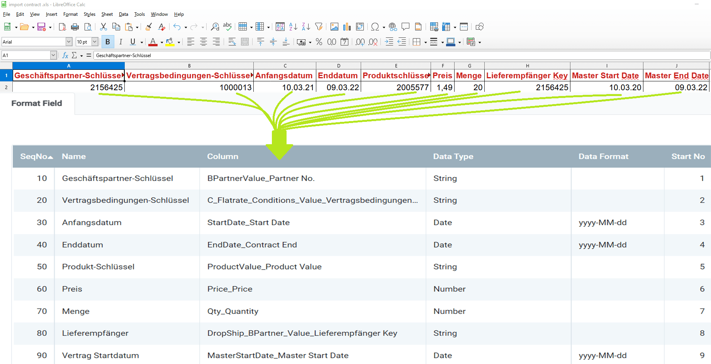

## Überblick
Für den Vertragsdatenimport benötigst du ein Importformat, in dem die **DB-Tabelle** *Contract Import* eingestellt ist.

In dem folgenden Beispiel wird der Dateninhalt einer Datei einer Tabellenkalkulationssoftware (hier z.B. eine *Excel*-Datei vor der [Konvertierung in eine CSV- oder TXT-Datei](Importdatei_nuetzliche_Hinweise)) dem Importformat für Vertragsdaten gegenübergestellt:

### Erläuterungen zum Beispiel
Die **Spalte A** der Excel-Tabelle (*Geschäftspartner-Schlüssel*) steht an erster Stelle, d.h das entsprechende Formatfeld bekommt die **Start-Nr. 1**.Demzufolge erhält das Formatfeld für die **Spalte B** die **Start-Nr. 2** usw.  Die **Reihenfolge** der Formatfelder ist dabei unerheblich.
 >**Hinweis:** metasfresh erwartet ***keine Spaltennamen*** in der Importdatei. Alleine die ***Position*** der Spalte muss mit der Startnummer übereinstimmen.

 - Der **Name** des Formatfeldes ist frei wählbar und muss nicht mit der Benennung der Spalte aus der Importdatei übereinstimmen.
 - Die **Spalte** des Formatfeldes bestimmt, wohin metasfresh den Inhalt der Spalte aus der Importdatei übertragen soll.
 - Der **Datentyp** bestimmt, ob es sich bei den Importdaten z.B. um eine *Zeichenfolge* oder *Zahl* handelt.

### Einige nützliche Hinweise
Die Angabe der Pflichtfelder ist unerlässlich für einen erfolgreichen Datenimport!

| Pflichtfeld | <abbr title="Bewege den Mauszeiger über den Feldnamen, um den entspr. Spaltennamen zu sehen.">Feldname</abbr> | Beispiel | Hinweis |
| :---: | :---: | :--- | :--- |
| X | <abbr title="BPartnerValue_Geschäftspartner-Schlüssel">Geschäftspartner-Schlüssel</abbr> | 2156425 | Die Geschäftspartnerschlüssel legt fest, welcher Geschäftspartner dieses Abonnement abschließt |
| X | <abbr title="C_Flatrate_Conditions_Value_Vertragsbedingungen-Schlüssel">Vertragsbedingungen-Schlüssel</abbr> | 1000013 | Der Vertragsbedingungen-Schlüssel legt fest, welche Vertragsbedingungen gültig sind|
| X | <abbr title="StartDate_Anfangsdatum">Anfangsdatum</abbr> | 10.03.2021 | Beginn der aktuellen Vertragsperiode |
|  | <abbr title="EndDate_Enddatum">Enddatum</abbr> | 09.03.2022 | Ende der aktuellen Vertragsperiode |
| X | <abbr title="ProductValue_Produktschlüssel">Produkt-Schlüssel</abbr> | 2005577 | Der Produktschlüssel gibt das verwendete Produkt an |
|  | <abbr title="Price_Preis">Preis</abbr> | 1,49 | Preis des gewählten Produkts |
|  | <abbr title="Qty_Menge">Menge</abbr> | 20 | Menge des gewählten Produkts |
| X | <abbr title="DropShip_BPartner_Value_Lieferempfänger_Key">Lieferempfänger</abbr> | 2156425 | Der Lieferempfängerschlüssel legt fest, an wen das Abonnement geliefert wird  |
|  | <abbr title="MasterStartDate_Master Start Date">Vertrag Startdatum</abbr> | 10.03.2020 | Beginn des Vertrags |
|  | <abbr title="MasterEndDate_Master End Date">Vertrag Enddatum</abbr> | 09.03.2022 | Ende des Vertrags |

## Nächste Schritte
- [Vertragsdaten importieren](Vertragsdaten_importieren).
