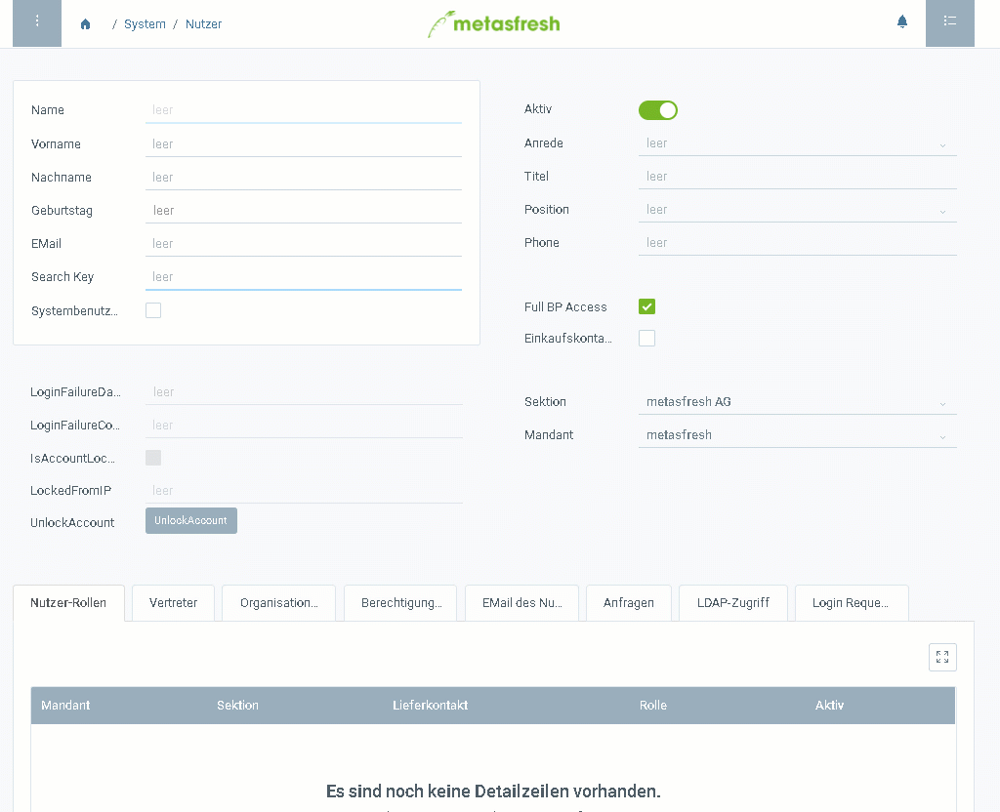

## Übersicht

Nutzer sind eigentlich Kontakte mit Anmeldeberechtigung. Deshalb findest Du die Kontakte Deiner Geschäftspartner ebenfalls im Fenster "Nutzer". 
Du kannst also neue Kontakte erstellen oder bestehenden Kontakten die Anmeldung im System ermöglichen, wenn Du diesen Schritten folgst:

## Schritte

### Erstelle einen Kontakt
1. [Melde Dich an](Anmeldung).
1. [Gehe ins Menü](Menu) und öffne das Fenster "Nutzer".
1. [Lege einen neuen Nutzer an](Neuer_Datensatz_Fenster_Webui).
1. Fülle die Felder **Vorname** und **Nachname** aus.
1. Der **Suchschlüssel** ist eine automatisch zugewiesene laufende Nummer. Unter Umständen kann man stattdessen jedoch auch einen eigenen Suchschlüssel manuell vergeben.

### Mache aus dem Kontakt einen Systembenutzer
1. Setze einen Haken bei **Systembenutzer**, um dem Kontakt Benutzerrechte zu geben.
1. Trage bei **Login** einen Benutzernamen ein.
 >**Hinweis 1:** Der Nutzer kann sich wahlweise mit dem **Login** oder der **Email** anmelden.  
 >**Hinweis 2:** Beachte beim Benutzernamen die **Groß- und Kleinschreibung**!

### Lege ein Passwort fest
1. [Starte die Aktion](AktionStarten) "Passwort ändern". Es öffnet sich ein neues Fenster.
1. Vergib ein **Neues Passwort** mit mindestens 8 Zeichen.
 >**Hinweis 1:** Ein **Altes Passwort** ist nicht erforderlich, wenn der Nutzer neu erstellt wird.  
 >**Hinweis 2:** Stelle sicher, dass das Passwort **mindestens 8 Zeichen** hat, sonst wird der Datensatz **nicht gespeichert**!  
 >**Hinweis 3:** Beachte beim Passwort die **Groß- und Kleinschreibung**!  
 >**Hinweis 4:** Halte  gedrückt, um das Password anzuzeigen.

1. Wiederhole das Passwort im Feld **Neues Passwort (retype)**.
1. Klicke auf "Start", um das neue Passwort zu übernehmen und das Fenster zu schließen.
1. [metasfresh speichert automatisch](Speicheranzeige).

### Weise dem Nutzer eine Rolle zu
1. Gehe zur Registerkarte "Nutzer-Rollen" unten auf der Seite und klicke auf . Es öffnet sich ein neues Fenster.
1. Wähle die Rolle aus, die der Nutzer haben soll.
1. Klicke auf "Bestätigen", um die Rolle zur Liste hinzuzufügen.
 >**Hinweis:** Der Nutzer kann auch mehrere Rollen haben. In diesem Fall wird er bei der Anmeldung nach der gewünschten Rolle gefragt.

## Beispiel

Dieses Beispiel zeigt die Erstellung eines Nutzers "mf" mit der Rolle "WebUI":

