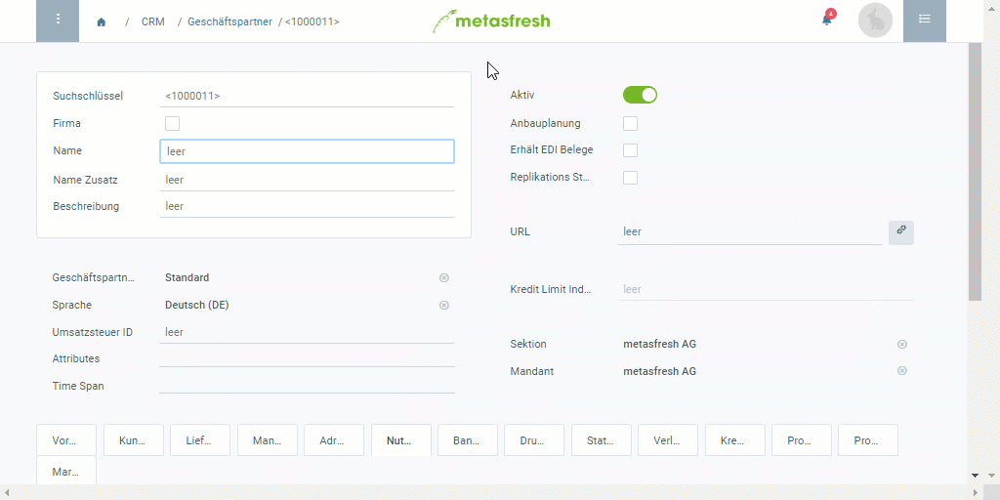

## Schritte
1. [Gehe ins Menü](Menu) und öffne das Fenster "Geschäftspartner".
1. [Lege einen neuen Geschäftspartner an](Neuer_Datensatz_Fenster_Webui).
1. Der **Suchschlüssel** ist eine automatisch zugewiesene laufende Nummer. Unter Umständen kann man stattdessen jedoch auch einen eigenen Suchschlüssel manuell vergeben.
1. Handelt es sich um eine **Firma**, setze bei dem entsprechenden Kontrollkästchen ein Häkchen und fülle das Feld **Firmenname** aus. Ist dies nicht der Fall, entferne das Häkchen und benenne den Geschäftspartner im Feld **Name**.
 >**Hinweis:** Der **Name/Firmenname** ist auf 60 Zeichen beschränkt.

1. Wähle eine [**Geschäftspartnergruppe**](Neue_Geschaeftspartnergruppe) aus, z.B. *Maschinenlieferant*.
1. Wähle die bevorzugte Kommunikations**sprache** des Partners aus.
1. Füge eine **URL** hinzu, wie z.B. die Website des Partners.
 >**Hinweis:** Beachte dabei, dass die URL mit dem Internetprotokollakronym beginnt (z.B. `https://`). Klicke rechts auf das Link-Symbol , um die Seite aufzurufen.

1. [Füge eine oder mehrere Adressen hinzu](Adresse_erfassen_Tab).
1. [metasfresh speichert automatisch](Speicheranzeige).

### Optionale Schritte
1. [Wähle geeignete **Attribute** für den Geschäftspartner aus](Attribute_GP_hinzufuegen), mit denen er sich per [Filterfunktion](Filterfunktion) einfacher und schneller finden lässt.
1. Mache aus dem Geschäftspartner einen [Kunden](Neuer_Geschaeftspartner_Kunde) und/oder [Lieferanten](Neuer_Geschaeftspartner_Lieferant).
1. [Verknüpfe den Geschäftspartner mit einem Preissystem](Zuweisung_Preise_Partner).
1. Erfasse Kontaktinformationen für den Geschäftspartner bzw. [verknüpfe ihn mit einem Nutzer](GPartner_Nutzer_hinzufuegen).
1. Erfasse zusätzliche [Tooltip-Informationen](GP_Memo_Tooltip) für den Geschäftspartner.

## Beispiel

