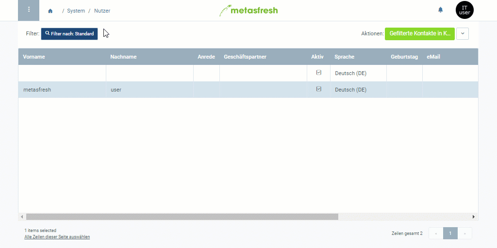

## Übersicht
Systembenutzer sind Kontakte (Nutzer) mit Anmeldeberechtigung zu Deinem System.

## Schritte
1. Öffne den Eintrag eines bestehenden [Nutzers](Menu) bzw. [lege einen neuen an](Nutzer_anlegen).

### Mache aus dem Kontakt einen Systembenutzer
1. Setze ein Häkchen bei **Systembenutzer**, um dem Kontakt Benutzerrechte zu gewähren.
1. Trage bei **Login** einen Benutzernamen ein.
 >**Hinweis 1:** Der Systembenutzer kann sich wahlweise mit dem **Login** oder der **Email** anmelden.  
 >**Hinweis 2:** Beachte beim Benutzernamen die ***Groß- und Kleinschreibung***!

### Lege ein Passwort fest
1. [Starte die Aktion](AktionStarten) "Passwort ändern". Es öffnet sich ein Overlay-Fenster.
1. Gib ein **Neues Passwort** mit mindestens 8 Zeichen ein.
 >**Hinweis 1:** Ein **Altes Passwort** ist nicht erforderlich, wenn der Nutzer neu erstellt wird.  
 >**Hinweis 2:** Stelle sicher, dass das Passwort ***mindestens 8 Zeichen*** hat, sonst wird der Eintrag ***nicht gespeichert***!  
 >**Hinweis 3:** Beachte beim Passwort die ***Groß- und Kleinschreibung***!  
 >**Hinweis 4:** Halte  gedrückt, um das Password anzuzeigen.

1. Gib das Passwort im Feld **Neues Passwort (retype)** erneut ein.
1. Klicke auf "Start", um das neue Passwort zu übernehmen und das Overlay-Fenster zu schließen.
1. [metasfresh speichert automatisch](Speicheranzeige).

## Nächste Schritte
- [Weise dem Systembenutzer eine Rolle zu](Nutzerrolle_zuweisen).
- ***Optional:*** [Weise dem Nutzer einen Geschäftspartner zu](Nutzer_GPartner_zuweisen).

## Beispiel

