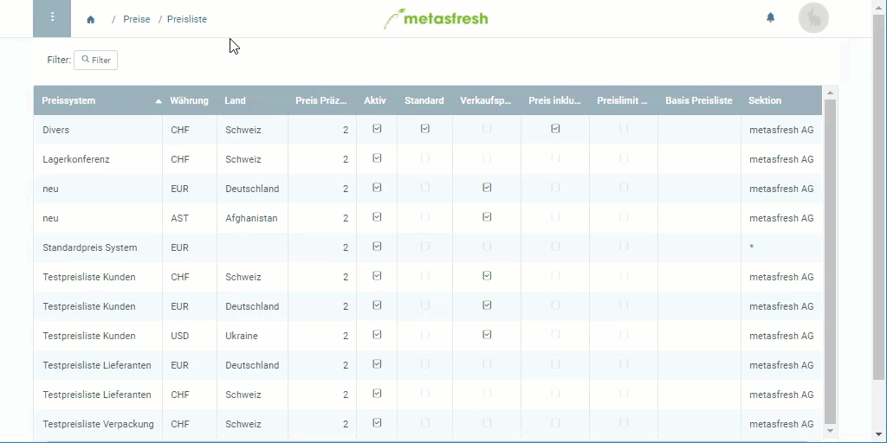

## Überblick

Preislisten können länder- und währungsspezifisch sein und somit einem bestimmten Partner (Kunden/Lieferanten) oder einer bestimmten Partnergruppe zugewiesen werden.

## Schritte
1. [Gehe ins Menü](Menu) und öffne das Fenster "Preisliste".
1. [Lege eine neue Preisliste an](Neuer_Datensatz_Fenster_Webui).
1. Benenne die Preisliste im Feld **Name**.
1. Wähle das **Land** aus, für das die Preisliste gelten soll.
 >**Hinweis:** Das Land der Preisliste **muss** mit dem Land der Liefer- und Rechnungsadresse des Partners **übereinstimmen**.

1. Wähle eine **Währung** aus.
1. Das Feld **Preispräzision** bestimmt, wie viele Nachkommastellen bei der Preisberechnung berücksichtigt werden.
1. Wähle das [**Preissystem**](Preissystem_anlegen) aus, mit dem die Preisliste verknüpft werden soll.
1. ***Optional:*** Stelle eine **Basispreisliste** ein. Gib hierzu einen Teil des Namens der gewünschten Preisliste ein und klicke auf den passenden Treffer in der <a href="Keyboard_Shortcuts_Liste#dropdown" title="Dynamisches Suchfeld (Autocomplete)">Dropdown-Liste</a>.
 >**Hinweis:** Die Basispreisliste wird dann herangezogen, wenn ein Produkt auf der aktuell verwendeten Preisliste nicht zu finden ist. Sie dient ebenfalls zur [Aktualisierung abgeleiteter Kundenpreislisten](Abgeleitete_PLV_aktualisieren).

1. Das Kontrollkästchen **Verkaufspreisliste** bestimmt, ob diese Preisliste für den *Verkauf* oder *Einkauf* verwendet werden soll. Ist das Häkchen gesetzt, wird sie z.B. im [Kundenauftrag](Auftrag_erfassen) auswählbar. Wird das Häkchen entfernt, wird es automatisch eine ***Einkaufspreisliste*** und somit z.B. in [Bestellungen](Bestellung_erfassen) verfügbar.
1. Das Kontrollkästchen **Preis inkl. Steuern** bestimmt, ob die Preise *brutto* oder *netto* (d.h. inklusive oder exklusive Mehrwertsteuer) zu verstehen sind. metasfresh berechnet die Preise dementsprechend.
1. ***Optional:*** Wähle eine **Standard Steuerkategorie** aus, die bei Auswahl der Preisliste automatisch eingestellt wird.
1. [metasfresh speichert automatisch](Speicheranzeige).

## Nächste Schritte
- [Lege eine Preislistenversion an](Preislistenversion_anlegen).

## Beispiel

