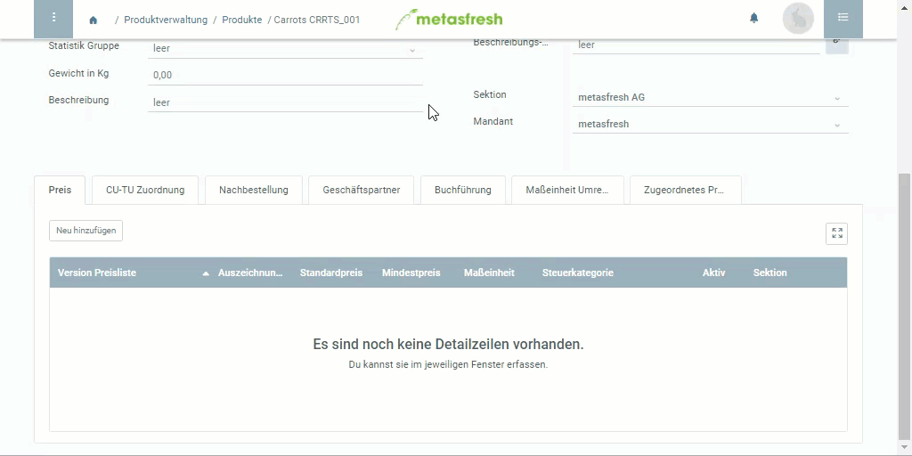

## Schritte

1. Öffne ein [bestehendes Produkt](NeuesProdukt).
1. [Lege einen neuen Datensatz](Neuer_Datensatz_Tab_Webui) unter der Registerkarte "Preis" an.
1. Gib unter **Version Preisliste** den Namen der vorgesehenen Preislistenversion ein, z.B. "Testpreise Kunden Deutschland (Verkaufspreisliste)".
  > Hinweis: Drücke die `LEERTASTE`, um alle verfügbaren Preislisten zu sehen.

1. Im Feld **Standardpreis** kannst Du den tatsächlichen Einkaufs- bzw. Verkaufspreis bestimmen (je nachdem, ob es sich um eine Einkaufs- oder Verkaufspreisliste handelt).
1. Im Feld **Steuerkategorie** kannst Du die jeweilige Mehrwertsteuerkategorie wählen, wie z.B. normal, reduziert, steuerfrei.
1. Schließe das Fenster mit "Bestätigen".

## Beispiel

## Weitere wichtige Felder
1. Das Feld **Auszeichnungspreis** dient nur zur Anzeige des Listenpreises auf Belegen.
1. Der **Mindestpreis** darf durch eine manuelle Preisänderung, z.B. in der Auftragszeile, nicht durch den Benutzer unterschritten werden.
1. Das Feld **Preiseinheit** bestimmt die Maßeinheit, für die der Preis gilt und ist nicht zu verwechseln mit der Maßeinheit des Artikels für die Bestandsführung!
