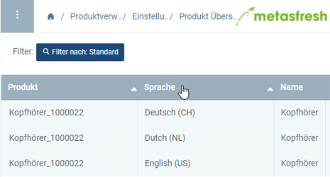

## Übersicht
In metasfresh kannst Du die Namen Deiner Produkte eigenständig in die Sprachen Deiner Geschäftspartner übersetzen. Sobald Du ein [neues Produkt angelegt](NeuesProdukt) hast, werden unter "Produkt Übersetzung" Einträge erstellt, in denen Du anschließend Deine Übersetzungen bearbeiten kannst.

Wenn Du nun die [Sprache Deiner Benutzeroberfläche änderst](SwitchLanguage) und zum Beispiel einen [Auftrag erstellst](Auftrag_erfassen), wird Dir bei der Massenerfassung der Produktname in der jeweiligen Sprache angezeigt.

Oder wenn Du [Belege druckst](PDFVorschau) für Geschäftspartner, die eine andere Sprache sprechen, dann wird der entsprechend übersetzte Produktname auf diesen Belegen aufgeführt.

## Übersetzungseintrag öffnen

### a) Über das Navigationsmenü
1. [Gehe ins Menü](Menu) und öffne das Fenster "Produkt Übersetzung".
1. [Verwende die Filterfunktion](Filterfunktion), um das Produkt zu finden, für das Du eine Übersetzung anlegen möchtest. Für jede verfügbare Sprache gibt es einen eigenen Eintrag (siehe Tabellenspalte **Sprache**).

 

### b) Aus dem Produkt über die Sidebar springen
Hast Du den Eintrag des zu übersetzenden Produkts bereits geöffnet, dann gehe wie folgt vor:

1. [Springe über die verknüpften Belege](SpringezuBelegen) des Produkts in das Fenster "Produkt Übersetzung" (unter "Produktverwaltung" in der Sidebar).
1. Im Fenster "Produkt Übersetzung" werden Dir alle Übersetzungseinträge für das ausgewählte Produkt angezeigt.

## Übersetzungen anlegen
1. Öffne den Eintrag der Sprache, in die Du übersetzen möchtest, z.B. "English (US)".
1. Ersetze im Feld **Name** die vorhandene Benennung mit Deiner Übersetzung.
1. [metasfresh speichert automatisch](Speicheranzeige).

## Beispiel

