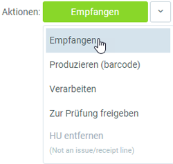

## Übersicht
metasfresh bietet zwei Möglichkeiten, den Materialverbrauch bei der Produktion zu protokollieren:
1. Produkt herstellen, ohne Material zu verbrauchen.
1. Produkt herstellen und Materialverbrauch protokollieren.

## Vorbereitung
Stelle sicher, dass Du diejenigen Produkte, die Du bei der Produktion verbrauchst, vorher auch auf Lager hast.
[Hier](Zu_Bestellung_Wareneingang_erstellen) kannst Du nachlesen, wie Du einen Wareneingang erstellst.

## Schritte
1. Lege einen [neuen Produktionsauftrag](NeuerProduktionsauftrag) an.
1. Wähle den Produktionsauftrag in der [Listenansicht](Ansichten) unter "[Produktionsaufträge](Menu)" aus.
1. [Starte die Aktion](AktionStarten) "Produzieren". Es öffnet sich das Produktionsfenster.
 > Hinweis: Hast Du den Produktionsauftrag in der Listenansicht ausgewählt, kannst du ebenfalls über den Aktionsbutton oben rechts die Aktion  starten.

### 1. Produkt herstellen, ohne Material zu verbrauchen
Dies ist die einfachste Möglichkeit in metasfresh zu produzieren. Hierbei wird die produzierte Menge einfach zugebucht, ohne die benötigten Produkte aus der Stückliste abzubuchen.

1. Klicke im Produktionsfenster das Produkt an, welches Du herstellen möchtest, z.B. "Karotten gestückelt".
 

1. Wähle über den Aktionsbutton "empfangen" aus. 
  
 > Hinweis: Wurde dem Produkt eine Gebindekonfiguration zugewiesen, erscheint diese auf dem Aktionsbutton anstelle von "empfangen".
  

1. Es öffnet sich ein neues Fenster.
 

1. Im Feld **Menge CU** trägst Du die fertiggestellte Menge des Produkts ein.

1. Im Feld **Menge TU** trägst Du die Menge der Verpackungseinheiten ein.
 > Hinweis: Die Menge TU muss **mindestens 1** betragen.

1. Im Feld **Menge LU** trägst Du die Menge der Ladehilfsmittel ein.
 > Hinweis: Wenn Du keine Menge LU benötigst, klicke einfach auf das  bei der Packvorschrift. Dann verschwindet dieses Feld.

1. Klicke auf "Start", um die Zuordnung zu speichern.

1. Nach erfolgreicher Zuordnung siehst Du die zugeordneten Produkte unterhalb des herzustellenden Produktes:
 

1. Wähle über den Aktionsbutton "Status: Planning complete" aus, um die Materialbuchungen vorzunehmen. Dadurch werden die Zeilen schreibgeschützt:
 

1. Klicke auf "Bestätigen", um das Fenster zu schließen.

## Beispiel 1

### 2. Produkt herstellen und Materialverbrauch protokollieren
Hierbei werden die für die Produktion benötigten Produkte aus der Stückliste abgebucht. Die Zubuchung der produzierten Menge erfolgt wie oben beschrieben.

1. Klicke im Produktionsfenster die Komponente (**CO**) an, welche Du aus der Stückliste abbuchen möchtest, z.B. "Karotten ungewaschen".
 

1. Wähle über den Aktionsbutton "hinzufügen" aus. 
 

1. Es öffnet sich eine Übersicht mit den passenden Produkten vom Lager.
 

1. Wähle die Handhabungseinheit (Handling Unit – HU) aus, welche für die Produktion verbraucht werden soll.

1. Wähle über den Aktionsbutton nochmals "hinzufügen" aus.

1. Nach erfolgreicher Abbuchung siehst Du die abgebuchten Produkte unterhalb der Komponente.

 > Hinweis: Möchtest Du die Abbuchung rückgängig machen, wähle einfach die hinzugefügte HU aus, gehe zum Aktionsbutton und klicke auf .

1. Klicke auf "Bestätigen", um das Fenster zu schließen.

## Beispiel 2

