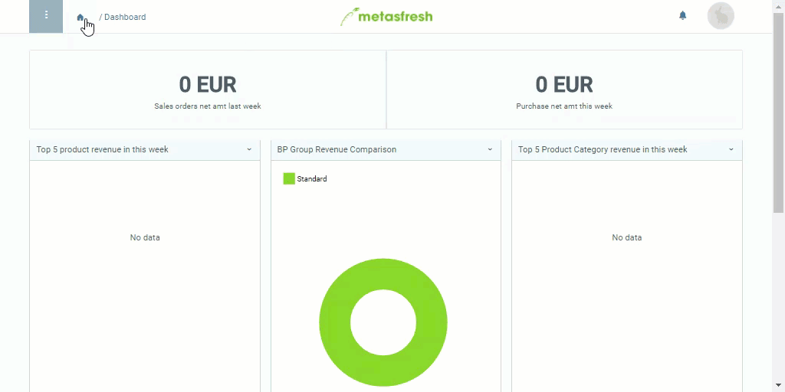

## Schritte
1. [Gehe ins Menü](Menu) und öffne das Fenster "Rabatte".
1. [Lege ein neues Rabattschema an](Neuer_Datensatz_Fenster_Webui).
1. Benenne das Rabattschema im Feld **Name**.
1. Wähle die **Rabattart** *Breaks* aus.
1. Stelle ein **Gültig ab** Datum ein.
 >**Hinweis:** Liegt das Datum in der *Vergangenheit*, gilt das Rabattschema *ab sofort*. Liegt es in der *Zukunft*, gilt es *erst ab diesem Datum*.

1. Gehe zur Registerkarte "Rabattkonditionen" unten auf der Seite und klicke auf . Es öffnet sich ein Overlay-Fenster.
1. ***Optional:*** Wähle ein **Produkt** oder eine **Produktkategorie** aus.
 >**Hinweis:** In diesem Fall gelten die Preiskonditionen ***nur*** für das ausgewählte Produkt oder die ausgewählte Produktkategorie. Bleiben die Felder leer, gelten die Preiskonditionen für alle Produkte auf der Preisliste.

1. Gib im Feld **Mengenstufe** die Anzahl ein, ab welcher eine Preiskondition gelten soll.
1. Gib im Feld **Mengenrabatt %** einen Prozentbetrag ein.
 >**Hinweis:** Ist dieser Betrag negativ, wird der Rabatt bei der Berechnung wie ein Zuschlag behandelt.

1. Klicke auf "Bestätigen", um das Overlay-Fenster zu schließen und die Preiskondition zur Liste hinzuzufügen.
 >**Hinweis:** Wiederhole die Schritte 6 bis 10, um weitere Preiskonditionen hinzuzufügen, wie z.B. für eine Rabattstaffel oder Rabatte für weitere Produkte/Produktkategorien.

## Nächste Schritte
- [Verknüpfe das Rabattschema mit einem Geschäftspartner](Rabattschema_mit_GP_verknuepfen).

## Beispiel

