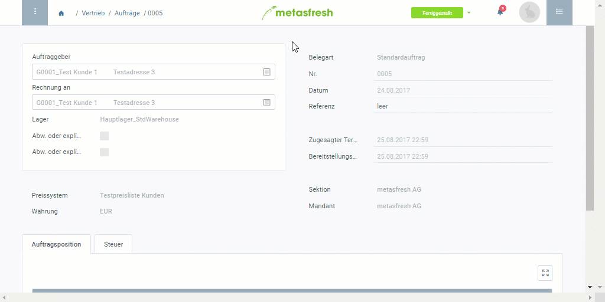

## Übersicht
In metasfresh kannst Du sowohl nach Fertigstellung eines Auftrages (und vor der Rechnungserstellung) als auch noch nach Rechnungserstellung die Rechnungsempfängerdaten bequem ändern. Im letzteren Fall muss hierzu jedoch die bisherige Rechnung erst storniert und nach den Änderungen erneut generiert werden.

| **Wichtiger Hinweis:** |
| :--- |
| Die abweichenden [Rechnungsadressen](Adresse_erfassen_Tab) und [-kontakte](GPartner_Nutzer_hinzufuegen) müssen vorher im jeweiligen [Geschäftspartner](Neuer_Geschaeftspartner)eintrag erfasst werden, damit sie Dir anschließend von metasfresh für die nachträgliche Änderung zur Auswahl gestellt werden können. |

## Schritte

### a) Vor der Rechnungserstellung
1. [Gehe ins Menü](Menu) und öffne das Fenster "Aufträge".
1. Öffne den Eintrag eines [fertiggestellten Auftrags](Auftrag_erfassen), für den Du die Rechnungsempfängerdaten ändern möchtest.
1. [Springe zur](SpringezuBelegen) "Rechnungsdisposition" und öffne den Eintrag des entsprechenden Rechnungskandidaten.
1. Öffne die "[Erweiterte Erfassung](Ansichten)" aus dem [Aktionsmenü](AktionStarten).
 >**Hinweis:** Drücke `Alt` + `E` / `⌥ alt` + `E`.

1. Wähle im Feld **Rechnungsadresse abw.** eine neue Rechnungsadresse aus.
1. Wähle im Feld **Rechnungskontakt abw.** einen neuen Rechnungskontakt aus.
1. Klicke auf "Bestätigen", um die Änderungen zu übernehmen und die "Erweiterte Erfassung" zu schließen.
1. [metasfresh speichert automatisch](Speicheranzeige).
1. [Erstelle die Rechnung](Zu_Auftrag_Rechnung_erstellen) mit den neuen Rechnungsempfängerdaten.

### b) Nach der Rechnungserstellung
1. [Storniere die Rechnung](Rechnung_stornieren), deren Empfängerdaten Du ändern möchtest.
1. Fahre fort mit der obigen **Anleitung a)** ab dem **Schritt 3**.

## Beispiel

