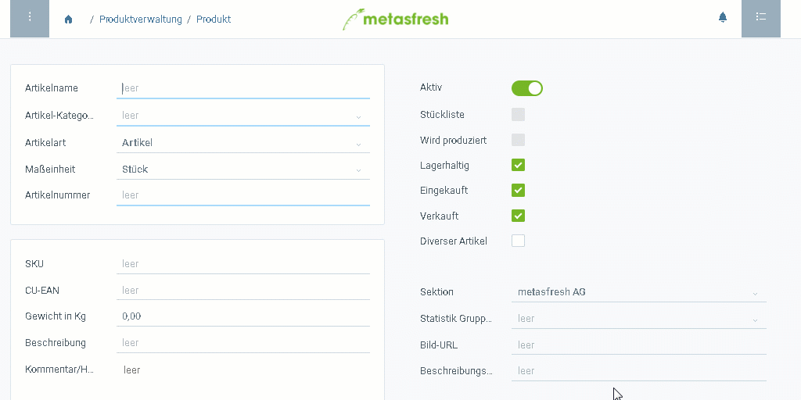

## Schritte
### Pflichtfelder

1. [Öffne das Fenster](Menu) "Produkt"
1. [Lege einen neuen Datensatz an](Neuer_Datensatz_Fenster_Webui)
1. Feld **Name** ausfüllen
> Hinweis: Dieser Name taucht auf den Belegen wie Auftragsbestätigung, etc. auf.

1. Feld **Artikelkategorie** auswählen
> Hinweis: Die **Artikelkategorie** kann verwendet werden um die Rabattierung, Kontierung und den Merkmalsatz eines Artikels zu steuern.

1. Feld **Artikelnummer** ausfüllen

 > Hinweis: Diese Nummer taucht auf den Belegen wie Auftragsbestätigung, etc. auf.

 > Hinweis 2: Diese Nummer kann auch automatisch vergeben werden.

#### Beispiel

### Weitere Felder

- Feld **Maßeinheit** bestimmt in welcher Einheit der Artikel bestandsgeführt wird

 > Hinweis: Sobald der erste Beleg existiert in dem der Artikel verwendet wird kann die Maßeinheit nicht mehr ohne weiteres geändert werden.

 > Hinweis: Eine abweichende Preisinheit kann unter Preis losgelöst von der Maßeinheit definiert werden.

- Feld **Artikelart** bestimmt um welche Art Artikel es sich handelt.

|	Option | Effekt |
|:	------------ | ------------- |
|	Artikel | materieller Artikel. z.B. Stückgut, Verpackung, etc. (Normalfall)|
|	Dienstleistung | immaterieller Artikel. z.B. Serviceleistung|
|	Erfolgskonto | Steuert Kontierung|
|	Ressource | Artikel der zeitlich nur einmal belegt werden kann. z.B. Maschine|

- Feld **Lagerhaltig** bestimmt ob der Artikel (insofern Artikelart auf Option "Artikel" steht) bestandsgeführt wird
- Feld **eingekauft** bestimmt ob der Artikel im Einkauf zu Verfügung steht
- Feld **verkauft** bestimmt ob der Artikel im Verkauf zu Verfügung steht
