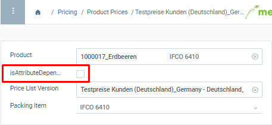
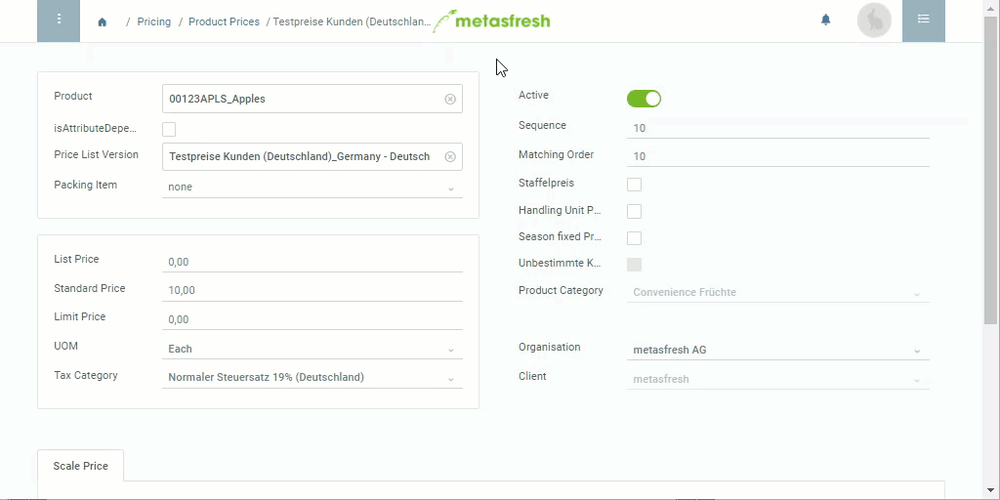

## Overview
When you sell a product you don't always sell it by the stock UOM. Instead you might determine a different sales UOM which can also be consolidated in a transport unit (TU).

Therefore, under "Product Prices", you can both determine packing instructions and set up whether the price shall depend on the stock UOM or the sales UOM.

## Steps
1. Open an existing [price](Menu) or [add a new one](Add_price).
1. Select a **Packing Item**.
 >**Note:** Packing items will only be suggested if they have been [allocated to the product](CU-TU_Allocation) beforehand.

1. If the price should be calculated based on the sales UOM defined in the price entry, check the box **isAttributeDependent**. Otherwise the product's stock UOM is used.
 >**Note:** If sales UOM ≠ stock UOM, you have to define a [UOM conversion](Convert_UOMs).

1. [metasfresh saves the progress automatically](Saveindicator).

 
#### How does the "Attribute Dependency" work?
**Case 1:** The price is *NOT* attribute dependent.

The box **isAttributeDependent** is unchecked: 

***Consequences:*** metasfresh calculates the order line total in the sales order based on the product's stock UOM.

Sales order: 
 

Stock UOM: 

 
**Case 2:** The price *IS* attribute dependent.

The box **isAttributeDependent** is checked: 

***Consequences:*** metasfresh calculates the order line total in the sales order based on the product's sales UOM (see above).

Sales order: 

## Example

