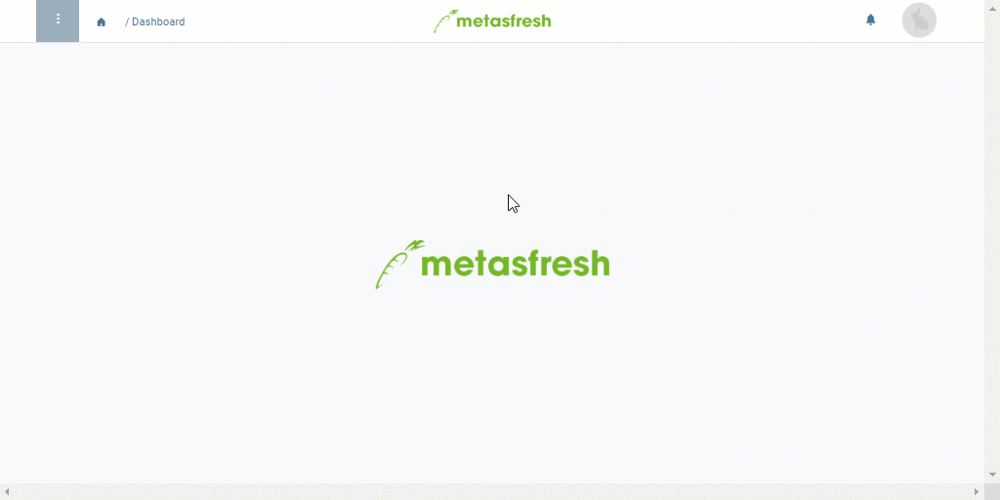

## Overview
A phone call schema version enables you to specify the days on which certain business partners are to be contacted and with what frequency. For this purpose, you can combine several parameters (weekdays, repetitions, time intervals) with each other as required and also associate them with business partners and their individual call times. Afterwards, by linking the version to a phone call schema, you can create prospective call lists that enable you to schedule phone calls far in advance while staying up to date and keeping track of pending calls, call times and contacts at all times.

## Requirements
- [Add a phone call schema](Add_phone_call_schema).

## Steps

### Pick a phone call schema and add a new schema version
1. Open "Phone Call Schema Version" from the [menu](Menu).
1. [Create a new phone call schema version](New_Record_Window).
1. Pick a **Phone Call Schema**, e.g., *Customer satisfaction survey*.
1. Give the schema version a **Name**, e.g., "Summer season survey".
1. Set a **Valid from** date.
 >**Note:** If this date lies in the *past*, the schema version will be effective *immediately*. If it lies in the *future*, it will only apply *from that date*. Older versions are automatically overridden by the more recent version.

### Specify weekdays, repetitions and time intervals
The following parameters can be combined with each other as desired and needed:

| Parameter | Description |
| :--- | :--- |
| Weekdays | Monday, Tuesday, Wednesday, Thursday, Friday, Saturday, Sunday |
| Time interval | weekly / monthly |
| Repetitions | • every *n* weeks  • every *n* months  • *n*th day of the month |

### Add a business partner
1. Go to the record tab "Phone Call Schema Version Line" at the bottom of the page and click . An overlay window opens up.
1. In the field **Business Partner**, enter a part of the [business partner](New_Business_Partner) name or number and click on the matching result in the [drop-down list](Keyboard_shortcuts_reference).
 >**Note:** If the business partner has a contact associated with them, the contact will be filled in here automatically.

1. Also in the field **Business Partner**, pick a contact, if the partner has more than one contact associated with their entry.
1. In the field **Minimun Call Time**, enter the earliest time when the partner can be reached.
 >**Note:** To do so, click into the input field and on the time display in the small overlay and then use the arrows  to set the time of your choice, or enter it manually.

1. In the field **Maximum Call Time**, enter the latest time when the partner can be reached.
 >**Note:** To do so, click into the input field and on the time display in the small overlay and then use the arrows  to set the time of your choice, or enter it manually.

1. Click "Done" to close the overlay window and add the business partner to the list.
 >**Note:** Repeat steps 1 to 6 to add further business partners.

1. [metasfresh saves the progress automatically](Saveindicator).

## Next Steps
- [Create automatic phone call schedules](Create_automatic_phone_call_schedules).

## Example

