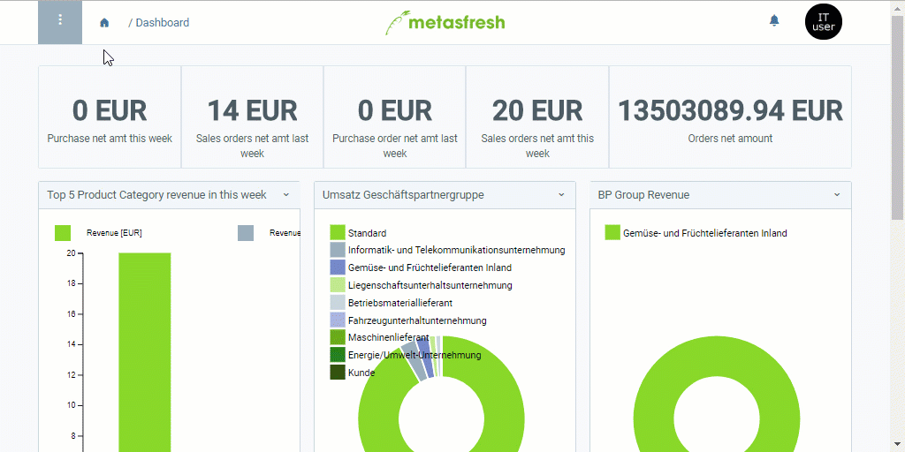

## Overview
A distribution network for empty containers becomes necessary at the point where empty containers that remain after the products they contain have been removed, have to be moved from one warehouse to another (here "empty container depot") for storage. This movement is mapped in a distribution network.

## Requirements
For the setup of the automatic distribution network for empty containers, the following data are required:

1. a main warehouse (already exists as default in metasfresh).
1. a shipper (already exists as default in metasfresh).
1. an [empty container depot](Add_empty_container_depot).

## Steps
1. Open "Distribution Configuration" from the [menu](Menu).
1. [Add a new distribution configuration entry](New_Record_Window).
1. Give the distribution configuration entry a **Name**, e.g. "Auto Distribution Network".
1. Enter a **No.**
1. Check the box **IsHUDestroyed**.
1. Go to the record tab "Network Line" at the bottom of the page and click . A new window opens up.
1. Select a **Source Warehouse**, e.g. *Main Warehouse*.
1. In the field **Warehouse** select a target warehouse, e.g. *Empty Container Depot*.
1. Select a **Shipper**, e.g. *In-house Transport*.
1. Click "Done" to close the window and add the network line to the list.

## Example

