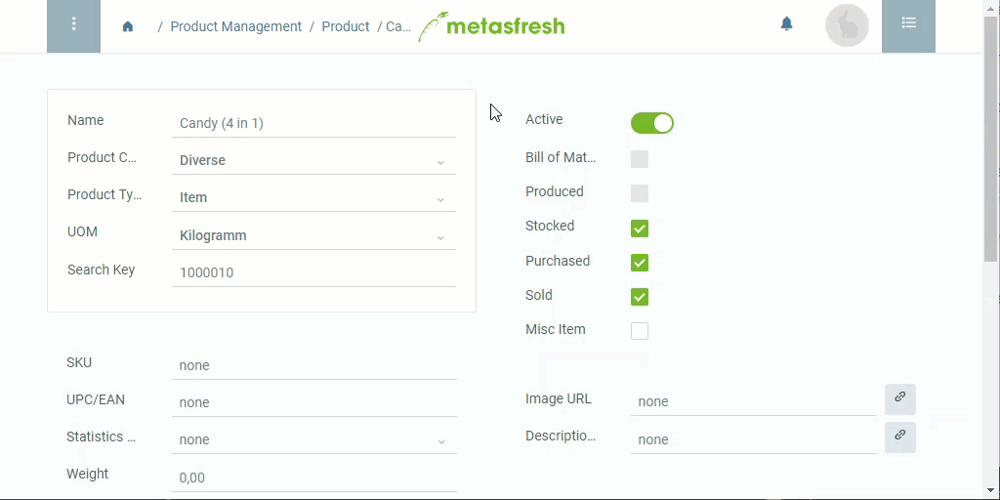

## Overview
If a product's stock-keeping UOM does not match its sales UOM, you have to define a UOM conversion.

#### For instance:
You keep strawberries with the stock-keeping UOM "kilograms" in your inventory but you sell them in clamshells of 250g, so with the sales UOM "each".

Ergo: 
1 kilogram of strawberries can be distributed into 4 clamshells of 250g each (apiece). 
1 clamshell therefore contains 0.25 kg of strawberries.

## Steps
1. Open the entry of an existing [product](Menu) or [add a new one](NewProduct).
1. Go to the record tab "UOM Conversion" at the bottom of the page and click . An overlay window opens up.
1. The field **UOM** specifies the source UOM and must be identical to the product's stock-keeping UOM, e.g., here "kilograms".
1. The field **Target UOM** specifies the UOM to convert into, e.g., here "piece".
1. The field **Factor from Target UOM** specifies the value by which to multiply the amount in the source UOM to obtain the corresponding amount in the target UOM (i.e. *1 source =* `?` *target*). 
***Example:*** `1 kg × 4 = 4 pieces`.
1. The field **Factor to Target UOM** specifies the value by which to multiply the amount in the target UOM to obtain the corresponding amount in the source UOM (i.e. *1 target =* `?` *source*). 
***Example:*** `1 piece × 0.25 = 0.25 kg`.
 >**Note:** Upon entering one of the values, the other will be calculated automatically.

1. Tick the checkbox **Target is catch UOM**, if the [catch weight](Sales_order_catch_weight) of weight-dependent products is to be used for invoicing.
1. Click "Done" to close the overlay window and add the conversion to the list.
 >**Note:** Repeat steps 2 to 8 to add further conversions.

## Example

