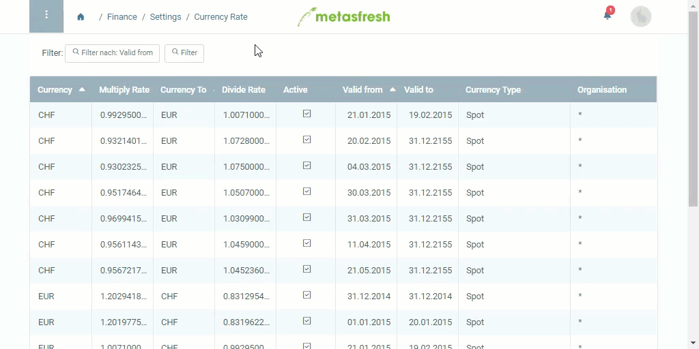

## Overview

If you want to work with currencies other than your master currency, you have to configure an exchange rate for the translation.

**Example:** You used the [initial setup wizard](InitialSetupWizard) to set your metasfresh system to USD, but you also want to work in EUR.

## Steps

1. Open "Currency Rate" from the [menu](Menu).
1. [Create a new Currency Rate](New_Record_Window).
1. Select a base currency (**Currency**) and a counter currency (**Currency To**), e.g. USD to EUR.
 >**Note:** Each exchange rate must be configured separately, e.g. USD to EUR, EUR to USD etc.

1. Enter *either* the factor to **Multiply Rate** by *or* the divisor to **Divide Rate** by.
 >**Note:** The other operand will be automatically calculated, respectively.

1. Select "Spot" as the **Currency Type**.
1. Set a **Valid from** date.
1. [metasfresh saves the progress automatically](Saveindicator).
1. Repeat steps 2 to 6 for further currency translations, e.g. EUR to USD.

## Error Message

If the currency translation is not configured correctly, an error message will appear when creating a goods receipt or an invoice that looks like this:

`... Unable to convert from currency $ ... to currency € ...`

## Example

