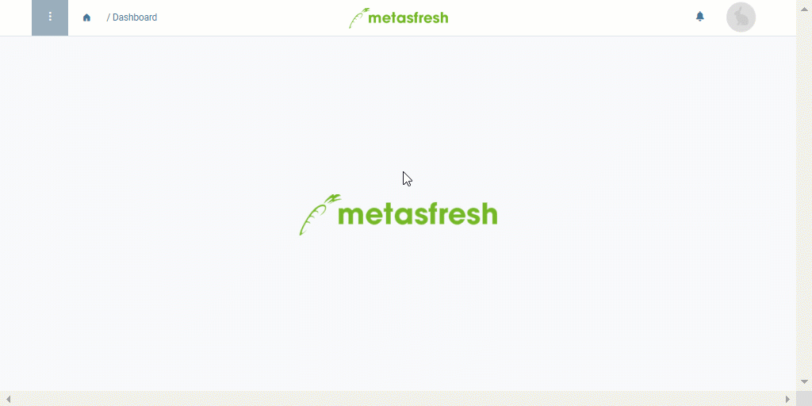

## Overview
In metasfresh, you can define individual sequence numbers for documents that can also be assigned to other entries, such as [product categories](NewProductCategory), in order for them to be sequentially numbered automatically based on the individual settings.

## Steps
1. Open "Document Sequence" from the [menu](Menu).
1. [Create a new entry](New_Record_Window).
1. Give the document sequence a **Name**.
1. Tick the checkbox **Auto numbering**. Additional fields appear.
1. The field **Current Next** shows the next value in the sequence.
1. The field **Increment** shows the number by which the next value will increase.
1. The field **Decimal Pattern** determines the length (number of digits) of the sequence. It is represented with zeros.
 >**Note:** A sequence consisting of five digits (e.g., 12345) would be represented as "00000".

1. In the fields **Prefix** and **Suffix** you can enter constants (alphanumeric strings) that will automatically be added before or behind the sequence number, respectively.
1. [metasfresh saves the progress automatically](Saveindicator).

## Next Steps (optional)
- [Customize document sequence numbers using affixes](Customizing_doc_seq_numbers).
- [Set the reference line of a sales order as document number for subsequent documents](Reference_as_doc_seq_number).

## Example

