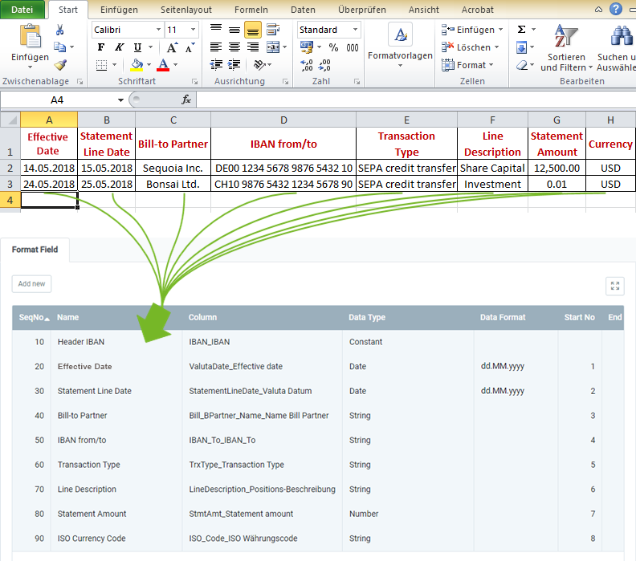

## Overview
For importing bank statement data, you require an import format that is configured with the **database table** *Import Bank Statement*.

The example below compares the data content of a file from a spreadsheet software (here, e.g., an *Excel* file prior to its [conversion to a CSV or TXT file](Import_file_useful_tips)) with the import format for bank statement data:

### Explanatory Notes to the Example
- **Column A** of the Excel spreadsheet (*Effective Date*) is in the first place, ergo the corresponding format field is given the **Start No. 1**. Consequently, the format field for **Column B** receives the **Start No. 2** etc.  The order (**SeqNo**) of the format fields is therefore irrelevant.
 >**Note:** metasfresh does ***not expect any column names*** in the import file. Simply the ***position*** of the column must correspond to the start number.

- The **Name** of the format field may be chosen freely and does not have to coincide with the column name in the import file.
- The **Column** of the format field specifies where metasfresh shall transfer the content of the column from the import file.
- The **Data Type** specifies whether the type of the import data is, e.g., a *String* or a *Number*.
- The first format field "Header IBAN" in the list with the data type *Constant* does not have a start number and therefore does not have to be included in the import file. The IBAN entered in the field in the column **Constant Value** will always be used as the company's transaction account for incoming and outgoing payments.

### Some useful notes
The mandatory fields as well as the requirement that the IBANs belong to existing bank accounts are essential for a successful data import!

| Mandatory Field | <abbr title="Hover your cursor over the field name to see the corresponding column name.">Field Name</abbr> | Example | Note |
| :---: | :---: | :--- | :--- |
| X | <abbr title="IBAN_IBAN">Header IBAN</abbr> | DE00 1234 5678 9876 5432 10 | IBAN of the account that is used for incoming and outgoing payments (usually, e.g., the company account) is stated here as a constant value. Therefore, it does not have to be included in the import file. |
|  | <abbr title="ValutaDate_Effective date">Effective Date</abbr> | 14.05.2018 | Date from when the money is effectively available. |
|  | <abbr title="StatementLineDate_Valuta Datum">Statement Line Date</abbr> | 15.05.2018 | Value date |
|  | <abbr title="Bill_BPartner_Name_Name Rechnungspartner">Bill-to Partner</abbr> | Sequoia Inc. | Name of the invoice recipient |
| X | <abbr title="IBAN_To_IBAN_To">IBAN from/to</abbr> | CH10 9876 5432 1234 5678 90 | IBAN of the recipient or payment account |
|  | <abbr title="TrxType_Transaction Type">Transaction Type</abbr> | SEPA credit transfer | Transaction type of the statement line |
|  | <abbr title="LineDescription_Positions-Beschreibung">Line Description</abbr> | Share Capital | Description of the statement line |
| X | <abbr title="StmtAmt_Statement amount">Statement Amount</abbr> | 12,500.00 | Amount of the statement line |
| X | <abbr title="ISO_Code_ISO Währungscode">Currency</abbr> | USD | Three-letter currency code (in acc. with ISO 4217).  (*You can look up the ISO currency code under "[Currency](Menu)" in the menu.*) |

## Next Steps
- [Import bank statement data](Import_bank_statement_data).
