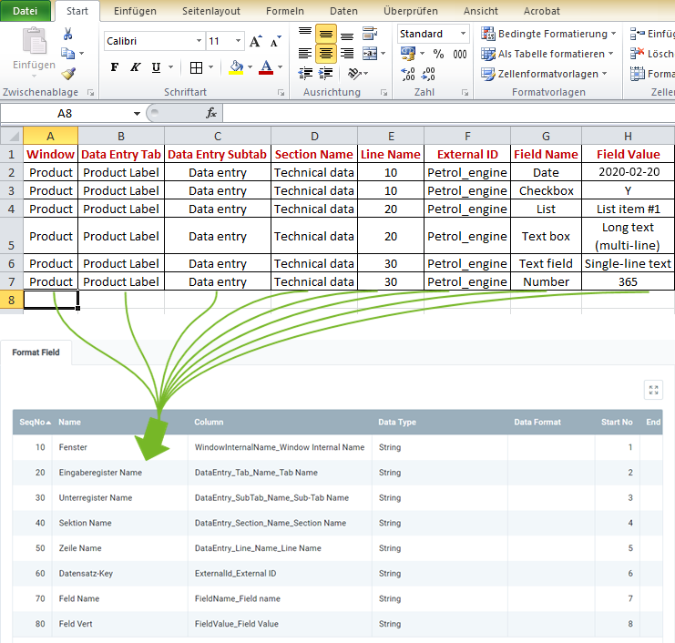

## Overview
For importing [custom data entries](Add_custom_record_tab), you require an import format that is configured with the **database table** *Import Data Entry Record*.

The example below compares the data content of a file from a spreadsheet software (here, e.g., an *Excel* file prior to its [conversion to a CSV or TXT file](Import_file_useful_tips)) with the import format for custom data entries:

### Explanatory Notes to the Example
- **Column A** of the Excel spreadsheet (*Window*) is in the first place, ergo the corresponding format field is given the **Start No. 1**. Consequently, the format field for **Column B** receives the **Start No. 2** etc.  The order (**SeqNo**) of the format fields is therefore irrelevant.
 >**Note:** metasfresh does ***not expect any column names*** in the import file. Simply the ***position*** of the column must correspond to the start number.

- The **Name** of the format field may be chosen freely and does not have to coincide with the column name in the import file.
- The **Column** of the format field specifies where metasfresh shall transfer the content of the column from the import file.
- The **Data Type** specifies whether the type of the import data is, e.g., a *String* or a *Number*.

### Some useful notes
The mandatory fields are essential for a successful data import!

| Mandatory Field | Field Name | Example | Note |
| :---: | :---: | :--- | :--- |
| X | Window | Product | System internal input window name. (If in doubt, please consult the system administrator.) |
| X | Data Entry Tab | Product Label | Name of the custom record tab |
| X | Data Entry Subtab | Data entry | Name of the subtab |
|  | Section Name | Technical data | Name of the section |
|  | Line Name | • 10  • 20  • ... | Sequence number of the line |
| X | External ID | Petrol_engine | Search key of the data entry |
| X | Field Name | Date | Name of the field  (**Important note:** If several fields have the same name, the section name and/or line sequence number ***must*** be specified!) |
|  | Field Value | 20.02.2020 | Value or content of the field.  The following values can be specified for the following field data types (see [Custom data entry - field](Add_fields_to_section_lines)):  • Date: `DD.MM.YYYY`  • Checkbox: Y (`= activated`), N (`= deactivated`)  • List: `Name of the list item`  • Text box: `Text (multi-line)`  • Text field: `Text (single-line)`  • Number: `Numeric value`   If no field value is specified, any existing field contents in the input tab will be deleted. |

## Next Steps
- [Import custom data entries](Import_custom_data_entries).
