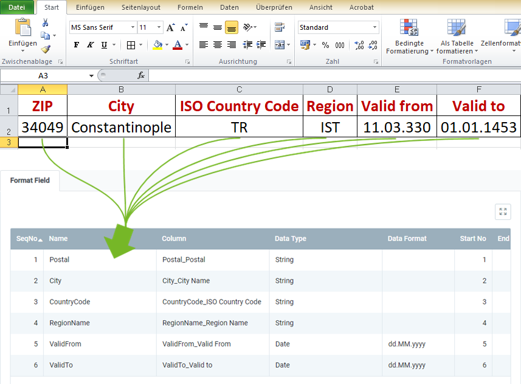

## Overview
For importing postal data, you require an import format that is configured with the **database table** *Import Postal Data*.

The example below compares the data content of a file from a spreadsheet software (here, e.g., an *Excel* file prior to its [conversion to a CSV or TXT file](Import_file_useful_tips)) with the import format for postal data:

### Explanatory Notes to the Example
- **Column A** of the Excel spreadsheet (*ZIP*) is in the first place, ergo the corresponding format field is given the **Start No. 1**. Consequently, the format field for **Column B** receives the **Start No. 2** etc.  The order (**SeqNo**) of the format fields is therefore irrelevant.
 >**Note:** metasfresh does ***not expect any column names*** in the import file. Simply the ***position*** of the column must correspond to the start number.

- The **Name** of the format field may be chosen freely and does not have to coincide with the column name in the import file.
- The **Column** of the format field specifies where metasfresh shall transfer the content of the column from the import file.
- The **Data Type** specifies whether the type of the import data is, e.g., a *String* or a *Number*.

### Some useful notes
The mandatory fields are essential for a successful data import!

| Mandatory Field | <abbr title="Hover your cursor over the field name to see the corresponding column name.">Field Name</abbr> | Example | Note |
| :---: | :---: | :--- | :--- |
|  | <abbr title="Postal_Postal">ZIP</abbr>  | 34049 | Postal code |
|  | <abbr title="City_City Name">City</abbr>  | Constantinople | Name of the city |
| X | <abbr title="CountryCode_ISO Country Code">ISO Country Code</abbr>  | TR | TR = **T**u**r**key  Two-letter country code (in acc. with ISO 3166-1 alpha-2).  (*You can look up the ISO country code under "[Country, Region](Menu)" in the menu.*) |
|  | <abbr title="RegionName_Region Name">Region</abbr>  | IST | IST = **Ist**anbul  (*You can look up the acronym (**Name**) of a region under the record tab "Region" of the respective country entry under "[Country, Region](Menu)" in the menu.*) |
|  | <abbr title="ValidFrom_Valid from">Valid from</abbr>  | 11.03.330 | Date from when the postal data are valid. |
|  | <abbr title="ValidTo_Valid to">Valid to</abbr>  | 01.01.1453 | Date until the postal data are valid. |

## Next Steps
- [Import postal data](Import_postal_data).
