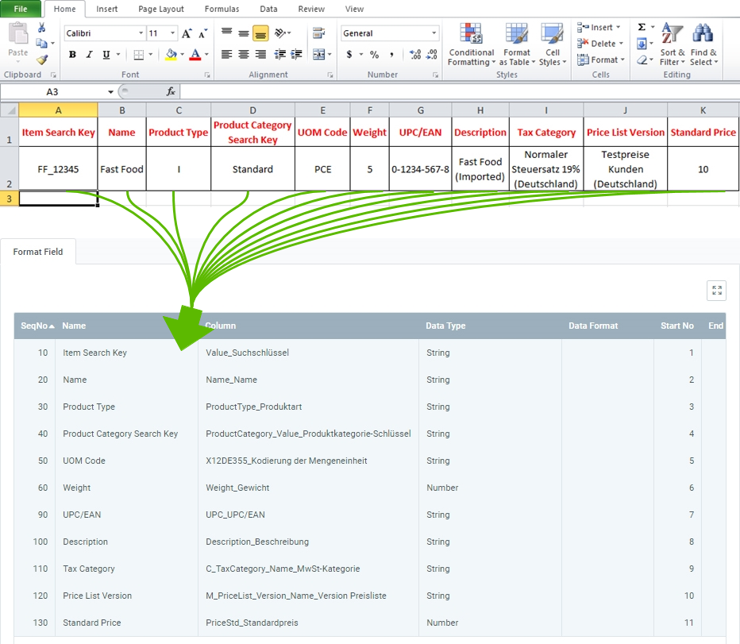

## Overview
For importing product data, you require an import format that is configured with the **database table** *Import Product*.

The example below compares the data content of a file from a spreadsheet software (here, e.g., an *Excel* file prior to its [conversion to a CSV or TXT file](Import_file_useful_tips)) with the import format for product data:

### Explanatory Notes to the Example
- **Column A** of the Excel spreadsheet (*Item Search Key*) is in the first place, ergo the corresponding format field is given the **Start No. 1**. Consequently, the format field for **Column B** receives the **Start No. 2** etc.  The order (**SeqNo**) of the format fields is therefore irrelevant.
 >**Note:** metasfresh does ***not expect any column names*** in the import file. Simply the ***position*** of the column must correspond to the start number.

- The **Name** of the format field may be chosen freely and does not have to coincide with the column name in the import file.
- The **Column** of the format field specifies where metasfresh shall transfer the content of the column from the import file.
- The **Data Type** specifies whether the type of the import data is, e.g., a *String* or a *Number*.

### Some useful notes
The mandatory fields are essential for a successful data import!

| Mandatory Field | Information | Example | Note |
| :---: | :---: | :--- | :--- |
| X | Item Search Key | FF_12345 | Alphanumeric string |
| X | Product Type | I | I = **I**tem  E = **E**xpense Type  R = **R**esource |
| X | Product Category Search Key | • Standard  • 16 | **Search Key** of the product category. ***Attention:*** Not the name!  (*You can look up the search key under "[Product Category](Menu)" in the menu.*) |
|  | UOM Code | PCE | PCE = Each (_**P**ie**ce**_)  (*You can look up the UOM code under "[Unit of Measure](Menu)" in the menu.*) |
|  | Tax Category | Reduzierter Steuersatz 7% (Deutschland) | You can look up the tax category under "[Tax Category](Menu)" in the menu. |
|  | Price List Version | Testpreise Kunden (Deutschland) | You can look up the price list version under "[Price List](Menu)" in the menu. |

## Next Steps
- [Import product data](Import_product_data).
