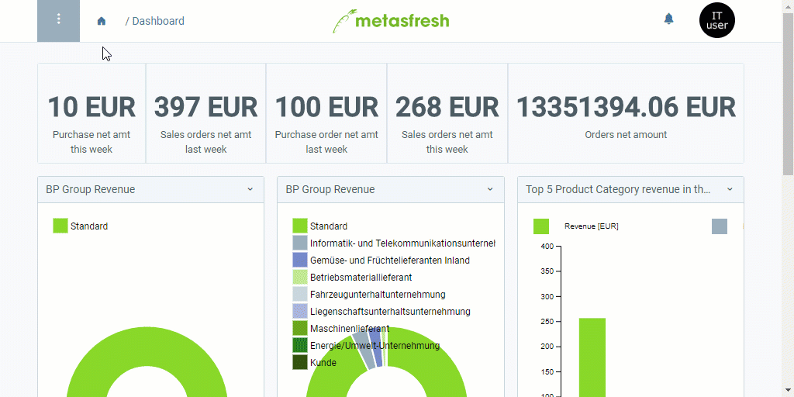

## Requirements
Make sure to comply with all requirements for the [data import in metasfresh](Data_import_metasfresh). [Here you can find a format example for importing product data](Import_format_example_product).
 >**Note:** For importing product data, you require an import format that is configured with the **database table** *Import Product*.

## Steps
1. Open "Data Import" from the [menu](Menu).
1. Open a suitable data import entry or [add a new one](Add_new_data_import_entry).

### Upload and import the file
1. [Upload your import file containing the product data](File_handling).
1. [Start the action](StartAction#actions-menu) "Import attachment". An overlay window opens up.
1. In the field **Attachment**, select the uploaded [import file](Import_file_useful_tips).
1. Click "Start" to import the product data and close the overlay window.

### Review Product Data
1. Open "Import Product" from the [menu](Menu). Here you will find all imported product entries.
1. Open the entry of the product whose data you want to review and correct, if necessary.
 - If all data were transferred properly and without errors, this product entry will be read-only and you can find the imported data under "[Product](Menu)" in the menu. All further changes can be made there.
 - In case data were transferred incorrectly or are missing after the import, you can review and edit each product entry under "[Import Product](Menu)". After having rectified all inaccuracies, you can now manually import the product data. To do so, please proceed as follows:

#### Manual Product Data Import
1. [Start the action](StartAction#actions-menu) "Import Products". An overlay window opens up.
1. Select a **Price List Version**.
1. Click "Start" to import the product data and close the overlay window.
1. You will find the imported product data under "[Product](Menu)" in the menu.

## Example

