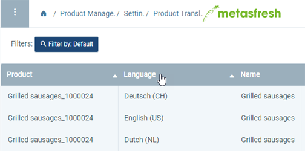
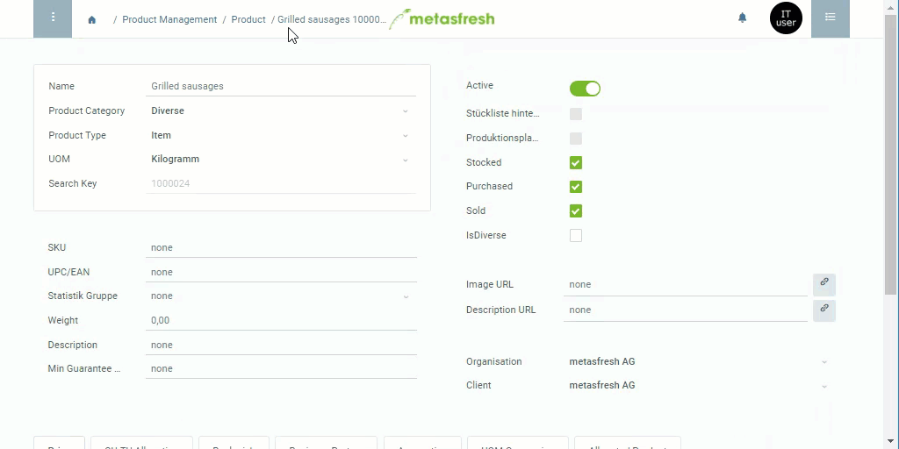

## Overview
In metasfresh, you can autonomously translate a lot of your data into the languages of your business partners, for both *internal* and *external* data management.

Currently, you can translate the data entries of the following menu items:
- [Bill of Material](Create_BOM)
- Document Type
- [Dunning Level](Define_Dunning_Type)\*
- Greeting
- Nutrition
- Payment Term
- [Product](NewProduct) (incl. [Product Description](Print_text_on_documents-product))
- [Product Category](NewProductCategory)
- Request Type
- Tax Category
- Tax Rate
- Unit of Measure

The moment you [add a new data entry](New_Record_Window), multilingual entries will be created in the respective translation windows in the menu where you can then edit your translations.

If, for example, you [add a new product](NewProduct), you can edit its translation entries under "Product Translation" in the menu.

When you [change your interface language](SwitchLanguage) and [create a sales order](SalesOrder_recording), for example, the product name will be displayed in the respective language when adding the products.

Or when you [print commercial documents](PrintPreview) for business partners who speak another language, the product name will then appear in their respective languages on these documents.

## Steps

### Open the translation entry

#### a) Via the navigation menu
1. Open the translation window of the entry in question from the [menu](Menu), e.g., "Product Translation".
1. [Use the filter](Filtering_function) to find the entry for which you want to add a translation. There is one entry for each available language (see column **Language**).  

#### b) Jumping from the entry via the sidebar
If you are already looking at the entry you want to translate, e.g., a product entry, you can take the following steps:

1. Use the entry's [related documents to jump](JumptoviaSidebar) into the corresponding translation window, e.g., "Product Translation" under PRODUCT MANAGEMENT in the sidebar.
1. In this window you will see all translation entries for the selected entry.

#### c) Jumping from the record tab via the context menu\*
If you want to translate record tab entries, as in the case of dunning levels, you can take the following steps:

1. Go to the record tab at the bottom of the page, e.g., "Level" for the dunning levels in the window of the respective [dunning type](Menu), and select the line you want to translate.
1. Use the [context menu](Jumpto_via_context_menu) to switch into the corresponding translation window, e.g., . Here you will now see a list of all translation entries for the selected entry.

### Add translations
1. Open the entry of the language into which you want to translate, e.g., "Deutsch (DE)".
1. Replace the existing **Name** with your translation.
 >**Note:** This step does not apply to "Dunning Level".

1. ***If applicable:*** Replace the existing **Print Name** with your translation.
 >**Note:** This step applies to "Document Type" and "Dunning Level".

1. ***If applicable:*** In the field **Name on Invoice**, enter the name that shall appear on the invoice.
 >**Note:** This step only applies to "Payment Term".

1. Tick the checkbox **Translated**.
1. [metasfresh saves the progress automatically](Saveindicator).
  

| **General Note:** |
| :--- |
| In principle, the changes in the field **Name** affect both *internal* and *external* data. This means, depending on the [language setting of the user interface](SwitchLanguage) or the [business partner's](New_Business_Partner) language, the **Name** will be displayed or printed on the documents in the respective language. Exceptions are, however, the data entries of the menu items "Document Type" and "Dunning Level".  Regarding "Document Type", the field **Name** merely determines the *internal* representation of the data entry. The *external* representation can be maintained through the additional field **Print Name**, as is also the case with "Dunning Level". The *internally* used name of the dunning level, however, can only be maintained in the respective [dunning type](Define_Dunning_Type) entry. |

## Example

