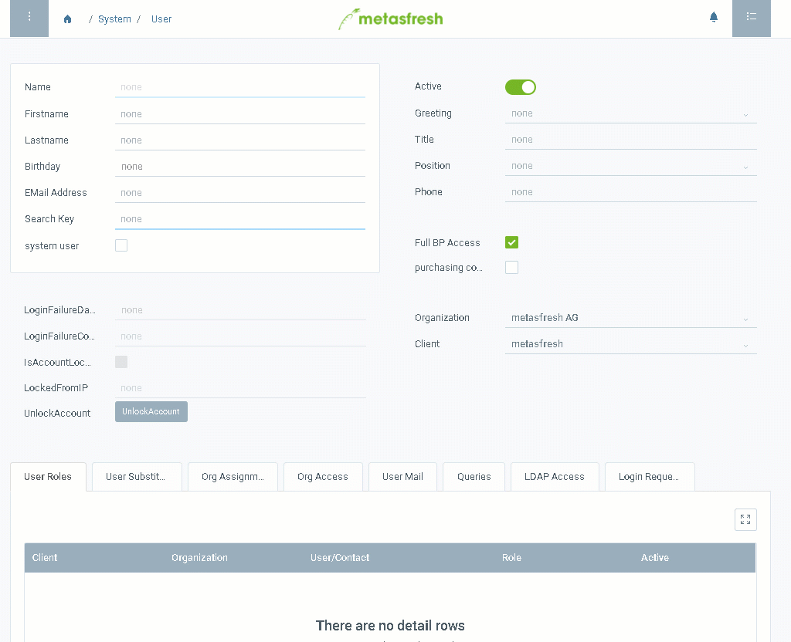

## Overview
Users are basically contacts with login permission. That is why you will also find the contacts of your business partners in the "User" window. 
You can create new contacts or allow existing contacts to log on to the system by following these steps:

## Steps

### Create a contact
1. [Log on](Logon) to the system.
1. Open "User" from the [menu](Menu).
1. [Add a new user](New_Record_Window).
1. Fill in the fields **Firstname** and **Lastname**.
1. The **Search Key** is an automatically assigned serial number. However, if required, it can also be assigned manually instead.

### Turn the contact into a system user
1. Tick the box **System User** to give the contact user permissions.
1. In the field **Login** enter a username.
 >**Note 1:** The user can log on using either the **Login** or the **Email Address** as username.  
 >**Note 2:** Mind that the username is ***case-sensitive***!

### Set a password
1. [Start the action](StartAction) "Change Password". A new window opens up.
1. Enter a **New Password** with at least 8 characters.
 >**Note 1:** An **Old Password** is not required if a new user is created.  
 >**Note 2:** Make sure the password consists of ***at least 8 characters*** or the new record ***will not be saved***!  
 >**Note 3:** Mind that the password is ***case-sensitive***!  
 >**Note 4:** Press and hold  to see the password.

1. Repeat the password in the field **New Password (retype)**.
1. Click "Start" to apply the new password and close the window.
1. [metasfresh saves the progress automatically](Saveindicator).

### Assign a role to the user to grant permission
1. Go to the record tab "[User Roles](NewUserRole)" at the bottom of the page and click . A new window opens up.
1. Select the role you want to assign to the user.
1. Click "Done" to add the role to the list.
 >**Note:** A user can have several roles. In this case, they will be asked to choose a role at the login.

## Example
This example shows the creation of a user "mf" with the role "WebUI":

