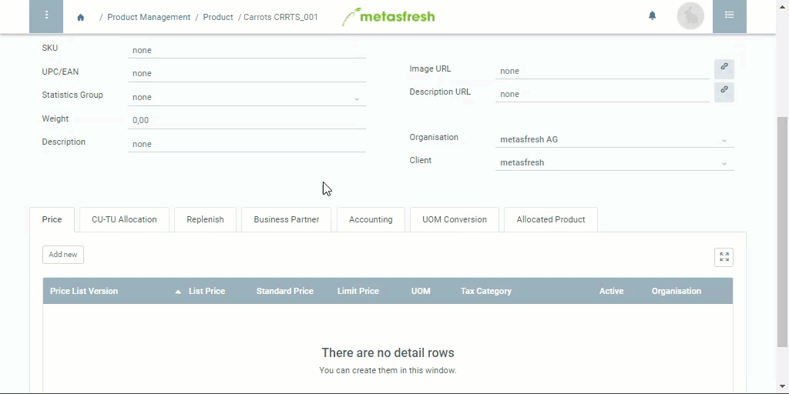

## Steps
1. Open the entry of an existing [product](Menu) or [add a new one](NewProduct).
1. Go to the record tab "Price" at the bottom of the page and click . An overlay window opens up.
1. Enter the name of the designated [**Price List Version**](Add_price-list-version) and click on the matching result in the [drop-down list](Keyboard_shortcuts_reference), e.g., "New Price List Germany".
1. The field **Standard Price** specifies the effectively valid purchase or sales price (depending on the respective price list).
1. The field **UOM** specifies the sales UOM and ***must not be confused*** with the product's stock UOM (inventory management)!
 >**Note:** If sales UOM ≠ stock UOM, you have to define a [UOM conversion](Convert_UOMs).

1. In the field **Tax Category**, you can select the respective value-added tax (VAT) category, such as *normal*, *reduced*, *tax-free*.
1. Click "Done" to close the overlay window and add the price list version to the list.

## Further Relevant Fields
1. The field **List Price** specifies the list price that will appear on the documents later on.
1. **Limit Price**: Manual price changes made by the user, e.g., in the order line, must not fall below this amount!
1. The field **UOM** specifies the unit of measurement for which the price applies (sales UOM) and must not be confused with the product's UOM used for inventory management (stock UOM)!

## Example

