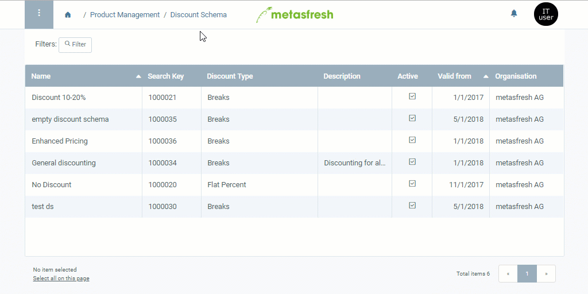

## Overview
In metasfresh, you can use one price list for several business partners. But what if you want to determine individual prices for specific partners? You do not want to create a new price list for each and every one of them, and end up with duplicated data and additional organizational overhead.

In this case, you can simply set up pricing conditions via the discount schema and link them to the business partner concerned. 
For this purpose, you can choose between two options:

- **Fixed Price:** You can determine a new standard price as a fixed price.
- **Surcharge on Standard Price:** You can add a surcharge to an existing standard price in a pricing system.

## Steps
1. Follow these [instructions for creating a discount schema](Create_discount_schema) up to **step 9**.

### a) Determine a fixed price
1. In the field **Price base**, select *Fixed*.
1. Enter a **Fixed price** that shall be used for the product(s) when the pricing conditions are fulfilled.

### b) Determine a surcharge on a standard price
1. In the field **Price base**, select *Pricing system*. A new field **Pricing System** appears.
1. In the field **Pricing System**, enter part of the desired base [pricing system](Add_price-system) and click on the matching result in the <a href="Keyboard_shortcuts_reference#dropdown" title="Dynamic Search Box (Autocompletion)">drop-down list</a>.
1. Enter a **Aufschlag auf Standardpreis** (*Surcharge on standard price*) that shall be added to the standard price defined in the base pricing system when the pricing conditions are fulfilled.

### Next Steps
1. Click "Done" to close the overlay window and add the pricing conditions to the list.
1. [Link the discount schema to a business partner](Link_discount_schema_to_BP).

## Example

