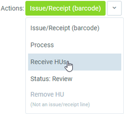
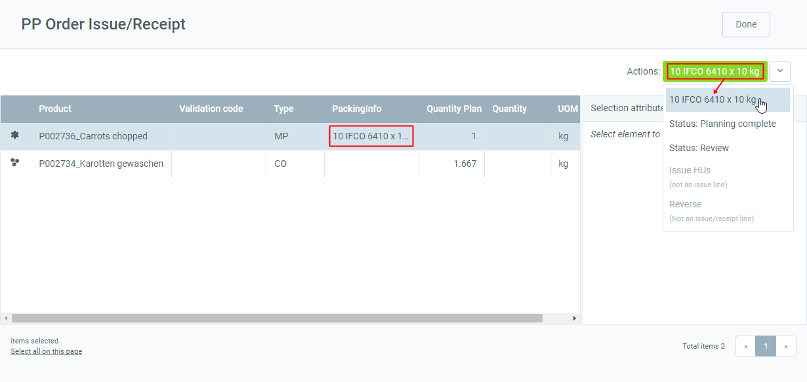
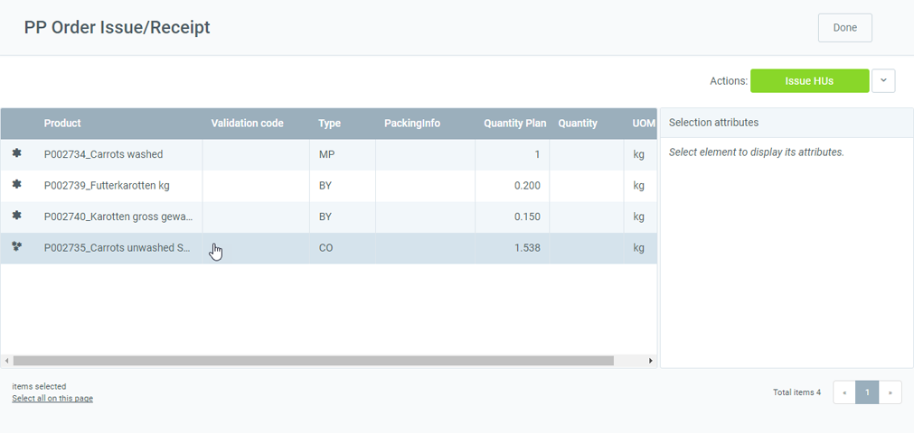
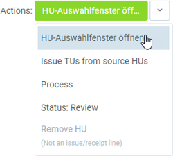

## Overview
metasfresh offers two possibilities to record the consumption of materials for production:
1. Produce a product without consuming material.
1. Produce a product and record the consumption of materials.

## Requirements
- Prior to production, ensure that all the required products to be consumed are on stock. 
For information on how to create a goods receipt, [click here](CreateGoodsReceipt).

## Steps
1. Open a [completed manufacturing order](NewManufacturingOrder).
1. [Start the action](StartAction) "Issue/Receipt". An overlay window, the production window "PP Order Issue/Receipt", opens up.
 >**Note:** If you have selected the manufacturing order while in [list view](ViewModes), you can also go to the [quick actions](StartAction) button at the top right to start the action .

### a) Produce a product without consuming material
This is the easiest way to produce in metasfresh. The produced quantity is simply added into stock without deducting the required components that are on the bill of materials (BOM).

1. In the production window, [select](RecordSelection) the product (**MP**) you want to produce, e.g., "Carrots chopped".
 

1. [Start the quick action](StartAction) "Receive HUs". 
  
 >**Note:** If the product has packing instructions, these will appear on the quick actions button instead of "Receive HUs".
   

1. Another overlay window opens up.
 

1. ***Optional:*** Select **TU Packing Instructions**.
1. ***Optional:*** Select **LU Packing Instructions**.
1. In the field **CU Quantity**, enter the received quantity of the product.
1. In the field **TU Quantity**, enter the number of transport units.
 >**Note 1:** The field **TU Quantity** appears only if **TU Packing Instructions** are available.  
 >**Note 2:** The TU Quantity must be ***at least 1***.

1. In the field **LU Quantity**, enter the number of loading units.
 >**Note 1:** The field **LU Quantity** appears only if **LU Packing Instructions** are available.  
 >**Note 2:** The field **LU Packing Instructions** appears only if **TU Packing Instructions** are available.  
 >**Note 3:** The LU Quantity must be ***at least 1***.

1. Click "Start" to record the received HUs and close the overlay window.
1. When the allocation was successful, the received HUs will be listed below the product to be produced:
 
 >**Note:** If you want to reverse the allocation, simply select the added HU, go to the quick actions button and click "Remove HU".

1. [Start the quick action](StartAction) "Process" to make the material posting. This makes the lines read-only:
 

1. Click "Done" to close the production window.

## Example 1

---

### b) Produce a product and record the consumption of materials
The BOM components required for the production are deducted from stock. Adding the produced quantity works as described above.

1. In the production window, [select](RecordSelection) the BOM component (**CO**) you want to deduct from stock, e.g., "Carrots unwashed".
 

1. [Start the quick action](StartAction) "Open HU Selection Window". 
 

1. An overview of the matching handling units (HU) from stock opens up on the right-hand side.
 

1. [Select](RecordSelection) the HU to be consumed for production.
1. Select "Issue complete HUs" via the actions button.
1. When the allocation was successful, you will find the issued HU below the component.

 >**Note:** If you want to reverse the deduction, simply select the added HU and start the quick action "Remove HU".

1. [Start the quick action](StartAction) "Process" to deduct the HUs. This makes the lines read-only:
 

1. Click "Done" to close the production window.

## Example 2

