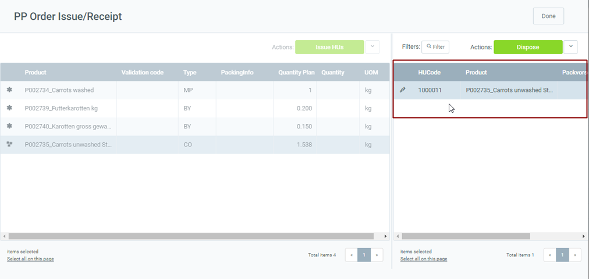

## Overview
metasfresh offers two possibilities to record the consumption of materials for production:
1. Produce a product without consuming material.
1. Produce a product and record the consumption of materials.

## Preparation
Prior to production, ensure that all the required products to be consumed are on stock. For information on how to create a Goods Receipt, see [here](CreateGoodsReceipt).

## Steps
1. Open a [completed Manufacturing Order](NewManufacturingOrder).
1. [Start the action](StartAction) "Issue/Receipt". The production window "PP Order Issue/Receipt" opens up.
 >**Note:** If you have selected the Manufacturing Order in the list view, you can also go to the [quick actions](StartAction) button at the top right to start the action .

### 1. Produce a product without consuming material
This is the easiest way to produce in metasfresh. The produced quantity is simply added to the account without booking the required products from the bill of material (BOM).

1. In the production window, click on the product you want to produce, e.g. "Carrots chopped".
 

1. Select "Receive HUs" via the quick actions button. 
  
 >**Note:** If the product was assigned Packing Instructions, this will appear on the quick actions button instead of "Receive HUs".
   

1. A new window opens up.
 

1. In the field **Quantity CU** enter the completed quantity of the product.

1. In the field **Quantity TU** enter the quantity of the packing units.
 >**Note 1:** The field **Quantity TU** appears only if **Packing Instructions TU** are available.  
 >**Note 2:** The Quantity TU must be **at least 1**.

1. In the field **Quantity LU** enter the quantity of loading equipment.
 >**Note 1:** The field **Quantity LU** appears only if **Packing Instructions LU** are available.  
 >**Note 2:** The field **Packing Instructions LU** appears only if **Packing Instructions TU** are available.

1. Click "Start" to save the assignment.

1. When the assignment was successful you will find the assigned products underneath the product to be produced:
 

1. Select "Status: Planning complete" via the quick actions button to make the material posting. This makes the lines read-only:
 

1. Click "Done" to close the window.

## Example 1

### 2. Produce a product and record the consumption of materials
The products required for the production are booked from the BOM. Adding the produced quantity works as described above.

1. In the production window, click on the component (**CO**) you want to book from the BOM, e.g. "Carrots unwashed".
 

1. Select "Issue HUs" via the quick actions button. 
 

1. An overview of the matching handling units (HU) from stock opens up.
 

1. Select the HU to be consumed for production.

1. Select "Issue selected HUs" via the actions button.

1. When the booking was successful, you will find the booked products below the component.

 >**Note:** If you want to reverse the booking, simply select the added HU, go to the quick actions button and click .

1. Click "Done" to close the window.

## Example 2

