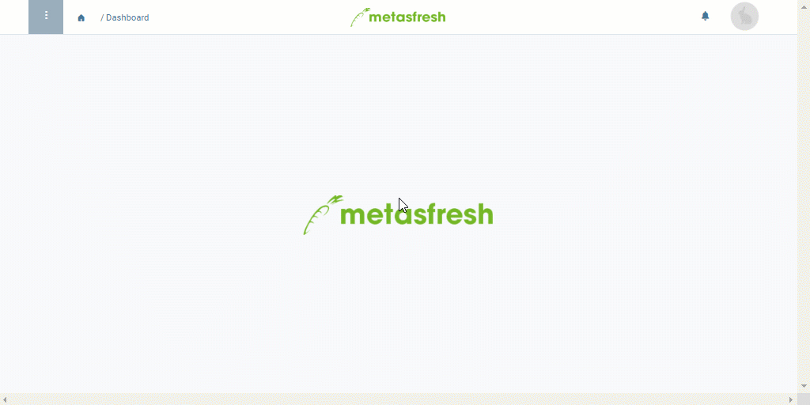

## Overview
Returning empties becomes necessary when you have received your ordered goods and want to return the packing material which was used to transport the delivered products (e.g., [packaging such as crates or loading equipment such as pallets](Handling_Unit_System)) to the vendor.

The empties return can be carried out either with reference to a particular purchase order or separately.

## Steps
1. Open "Material Receipt Candidates" from the [menu](Menu).

### a) Returning empties separately
1. [Start the quick action](StartAction#quick-actions) "Empties Return". The window "[Empties Return](Menu)" opens up in the same tab.
 >**Note:** You will also find this action in the actions menu in the list view.

1. In the field **Business Partner**, enter part of the name or number of the [vendor](New_business_partner_vendor) to whom you are returning the empties and click on the matching result in the <a href="Keyboard_shortcuts_reference#dropdown" title="Dynamic Search Box (Autocompletion)">drop-down list</a>.
 >**Note:** If the required partner does not appear in the list, you can add them through [quick create](Quick_create_new_business_partner).

### b) Purchase order-related empties return
1. From the [list view](ViewModes#list-view), [select](RecordSelection) the entry of the [purchase order](CreatePurchaseOrder) whose empties you want to return.
1. [Start the quick action](StartAction#quick-actions) "Empties Return". The window "[Empties Return](Menu)" opens up in the same tab.
 >**Note:** You will also find this action in the actions menu in both the list view and the detailed view of an entry.

1. In this entry, all order-relevant data have already been entered (see also the [advanced edit menu](ViewModes#adv-edit) from the [actions menu](StartAction#actions-menu)).

### Record empties
1. Go to the record tab "Positionen" (*Shipment Line*) at the bottom of the page and click  to enter the empties.
 >**Note:** Use shortcut `Alt` + `Q` / `⌥ alt` + `Q`.

1. In the field **Boxing Type**, enter part of the name of the [packing material](Set_up_packing_material) to be returned and click on the matching result in the <a href="Keyboard_shortcuts_reference#dropdown" title="Dynamic Search Box (Autocompletion)">drop-down list</a>.
1. Enter a **Quantity**.
 >**Note:** Use the mouse or `Tab ↹` key to go to the field.

1. Hit `↵ Enter` to add the line to the list.
 >**Note:** Repeat steps 1 to 4 until you have recorded all packing materials.

 

| **General Note:** |
| :--- |
| You can also enter negative values as **Quantity**, which lets you post an empties return as an [empties receipt](Record_empties_receipt) without having to enter it in a separate document. This can be useful, for example, if empties are exchanged between vendors. |

### Complete the empties return
1. [Complete the document](DocumentProcessingComplete).
1. [Open the PDF preview](PrintPreview).

## Next Steps (optional)
- [Reverse the empties return](Reverse_empties_return).

## Example

