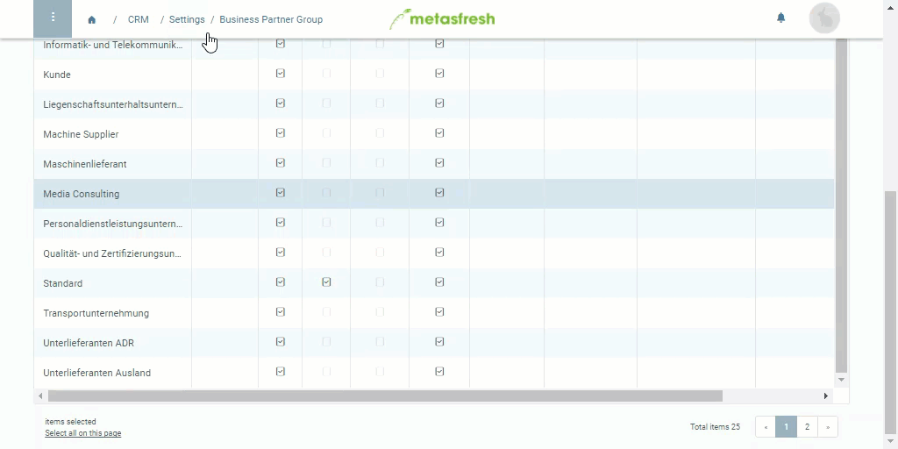

## Overview
For a dunning type to take effect in connection with a partner, you first need to link it to the corresponding partner. You can link it to both a single customer and a business partner group.

## Link dunning type to a single customer

### Steps
1. Open the entry of an existing customer from your [business partners](Menu) or [add a new one](New_business_partner_customer).
1. Go to the record tab "Customer" at the bottom of the page and open the [advanced edit menu](Open_AdvancedEditTab) of the customer line.
 >**Note:** The business partner must be registered as a customer for dunning to become available.

1. In the field **Dunning**, select the desired dunning type.
1. Click "Done" to close the advanced edit menu and apply the changes.
 >**Note:** Alternatively, you can also double-click the field in the column **Dunning** of the customer line and select a dunning type from the drop-down list.

### Example

---

## Link dunning type to a business partner group

### Steps
1. Open the entry of an existing [business partner group](Menu) or [add a new one](New_Business_Partner_Group).
1. Open the [advanced edit menu](ViewModes) from the [actions menu](StartAction).
 >**Note:** Use shortcut `Alt` + `E` / `⌥ alt` + `E`.

1. Scroll down to the field **Dunning** and select the desired dunning type.
1. Click "Done" to close the advanced edit menu and apply the changes.

### Example

